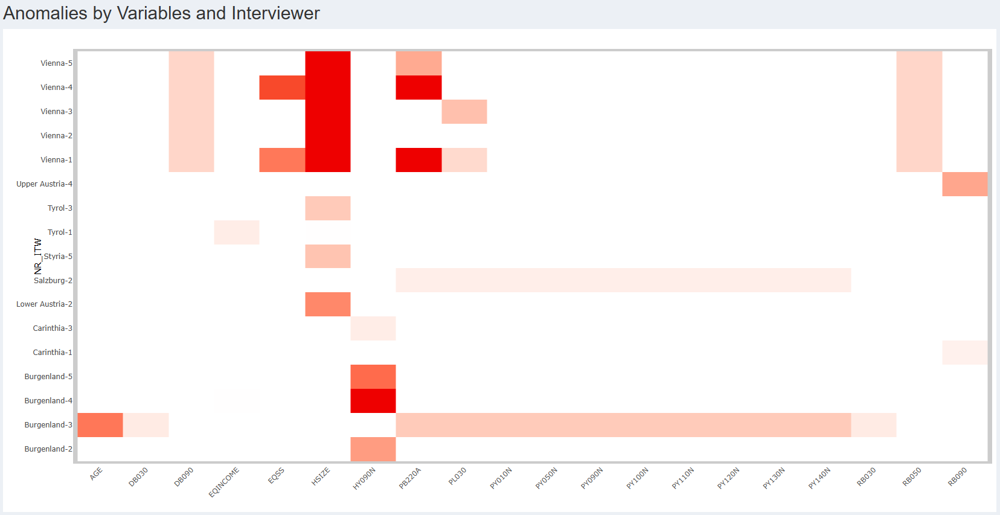

<!-- README.md is generated from README.Rmd. Please edit that file -->

# vizsurvey

<!-- badges: start -->

[](https://www.gnu.org/licenses/gpl-3.0)

<!-- badges: end -->

`vizsurvey` is an R package designed to streamline the quality
assessment of survey data by providing intuitive visual diagnostics
through an interactive dashboard. `vizsurvey` is especially useful for
institutions or researchers conducting large-scale surveys with multiple
interviewers, enabling a fast and systematic overview of data quality
over time.

## Key features

- Interactive Shiny dashboard for real-time data exploration
- Automated computation of summary statistics by domain, group, or
  interviewer
- Heatmap visualization for anomaly detection
- Tools for preparing and managing multiple survey datasets

Full documentation and vignettes are available (currently available in
French) at <https://tdelc.github.io/vizsurvey>

## Installation

You can install the development version of `vizsurvey` from github like
so:

``` r
install.packages("devtools") # if necessary
library(devtools)

devtools::install_github("tdelc/vizsurvey")
```

A CRAN release is planned once version 1.0.0 is reached.

## What is `vizsurvey` ?

`vizsurvey` provides a comprehensive set of R functions designed to
automate key statistical computations on survey data by *domain* or
*interviewer*. These functions ensure that summary indicators,
distributions, and consistency checks can be produced efficiently and
reproducibly across multiple survey waves. At the core of these analyses
lies the heatmap module, a graphical function (in `ggplot` and `plotly`)
that visualizes deviations and irregularities at a glance, making it
easier to detect outliers or recurring anomalies. Together, the
computational tools, visualization features, and interactive Shiny
dashboard make `vizsurvey` a complete environment for the monitoring,
exploration, and quality assessment of survey data.

## How to use `vizsurvey` ?

`vizsurvey` can be used in two complementary ways. First, users can call
its core R functions directly to generate summary statistics or to
produce the heatmap visualizations programmatically. These functions are
fully documented and illustrated in a [dedicated
vignette](https://tdelc.github.io/vizsurvey/articles/methods.html)
(currently available in French, with an English version forthcoming).
This approach is ideal for integration into automated workflows or
reproducible reports.

Alternatively, users can simply launch the interactive dashboard, which
provides an intuitive graphical interface for exploring survey data,
filtering by domain or interviewer, and visualizing anomalies in real
time. The function `runVizsurvey` is the easier way to launch the
dashboard. It will be empty, you will then need to load your own
dataset.

``` r
library(vizsurvey)
runVizsurvey()
```

Considering the interviewer effect, anomalies are displayed in a heatmap
by interviewer ID and by variable. Each cell can be clicked to display
detailed plots showing the distribution of responses and the comparison
between the interviewer and the rest of the population.




For the domain effect, a list of detected anomalies is provided,
together with a set of dedicated figures that help users understand the
nature and potential source of each issue.

 

All the use of the interactive dashboard is documented in a
[vignette](https://tdelc.github.io/vizsurvey/articles/vizsurvey.html).

We can also launch the dashboard with a specific dataset. Here is an
example with a R dataset. We use the `eusilc` dataset from `laeken` and
add a fake interviewer id.

``` r
# EU-SILC data
library(laeken)
data(eusilc)

# Fake ID
set.seed(123)
eusilc$NR_ITW <- paste(eusilc$NR_ITW,sample(1:5,nrow(eusilc),replace = T),sep="-")

# Vizsurve
runVizsurvey_from_r(eusilc,var_itw = "NR_ITW",var_group = "db040")
```

We can also launch the dashboard directly with a CSV file. We provide
some [Public Use
Files](https://ec.europa.eu/eurostat/web/microdata/public-microdata/statistics-on-income-and-living-conditions)
for EU-SILC from Eurostat.

``` r
path <- "inst/extdata/SILC/HFILE/BE_2012h_EUSILC.csv"
runVizsurvey_from_file(path,var_itw = "NR_ITW",var_group = "db040")
```

[A dedicated
vignette](https://tdelc.github.io/vizsurvey/articles/data-preparation.html)
also describes how to prepare the data required to use the dashboard
from `vizsurvey` through the function `runVizsurvey_from_folder`. This
functionality is specifically designed for institutions managing
multiple surveys on a regular basis, often involving several team
members in the process. In such contexts, launching the dashboard
manually for each dataset can quickly become inefficient, and computing
differences by domain or group may require substantial resources. To
address this, `vizsurvey` provides a set of automated data preparation
functions, allowing teams to structure their files consistently and
generate all necessary objects for the application to run smoothly and
systematically across multiple surveys.

``` r
# We assume that config.txt, and prepa_surveys are already done here.
# See vignette to learn how to prepare data folders
runVizsurvey_from_folder("inst/extdata",depth_folder = 3)
```

## Development Notes

Current Version : 0.1.0

The names of the functions and arguments in `vizsurvey` are still under
evaluation and may evolve based on early user feedback. As the package
is currently in its initial development phase, some naming conventions
may be refined to improve clarity, consistency, and usability. Our goal
is to achieve full naming stability starting from version **1.0.0**,
once the package has benefited from the first round of testing and
contributions from the community.

`vizsurvey` builds upon a wide range of existing R packages, combining
robust data-processing tools with flexible visualization and dashboard
components. Two main layers can be distinguished in the package
architecture:

- Core computation layer (data preparation and analysis) mostly based on
  the *tidyverse* ecosystem and related packages, ensuring readability
  and efficiency in handling large survey datasets : `cli`,
  `data.table`, `dplyr`, `lubridate`, `magrittr`, `purrr`, `rlang`,
  `scales`, `stats`, `tibble`, `tidyr`, `tidyselect`

- Dashboard and visualization layer providing an interactive interface
  to explore results, monitor anomalies, and visualize distributions :
  `ggplot2`, `corrplot`, `DT`, `gt`, `plotly`, `shiny`,
  `shinydashboard`, `summarytools`

## Author

**Thomas Delclite** is statistical methodologist and work à Statbel, the
Belgian Statistical Office.

Feedback and contributions are welcome.


