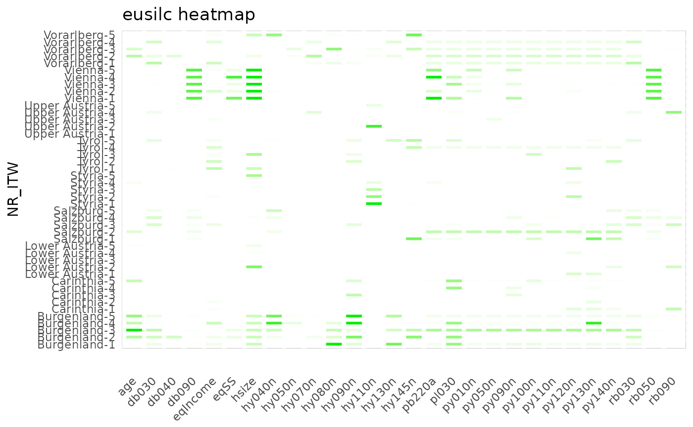
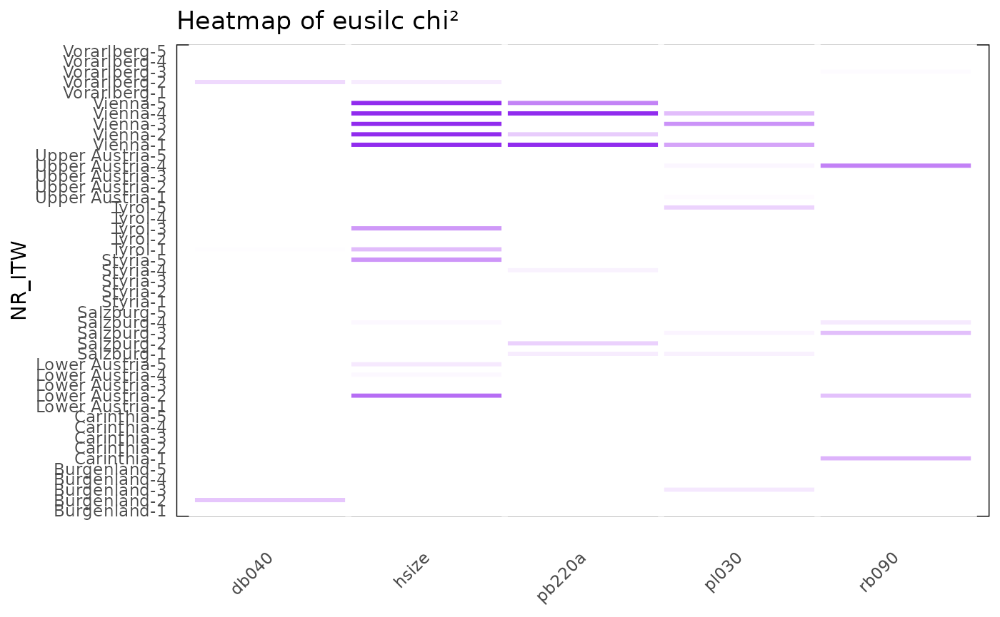
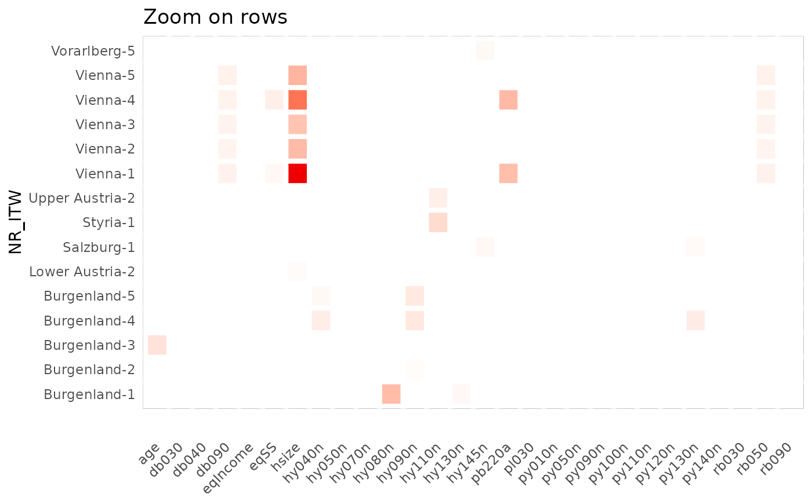
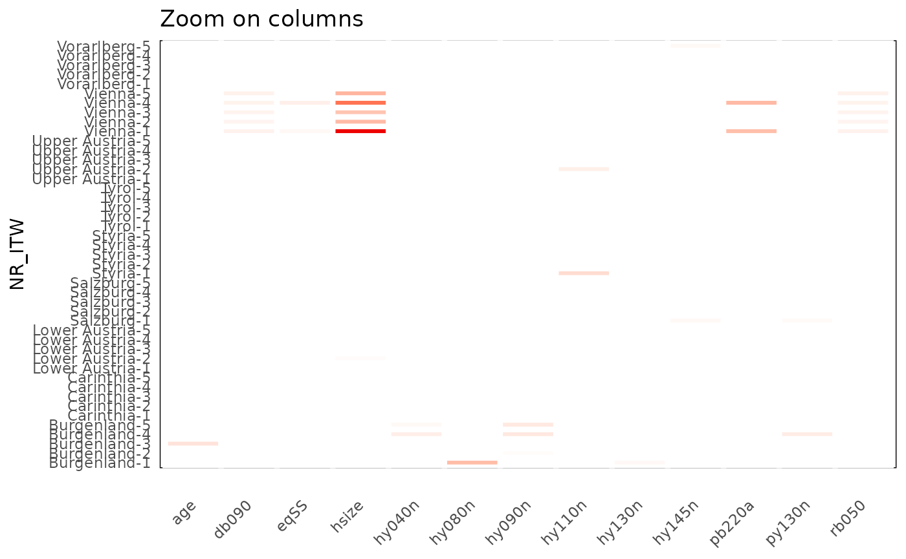
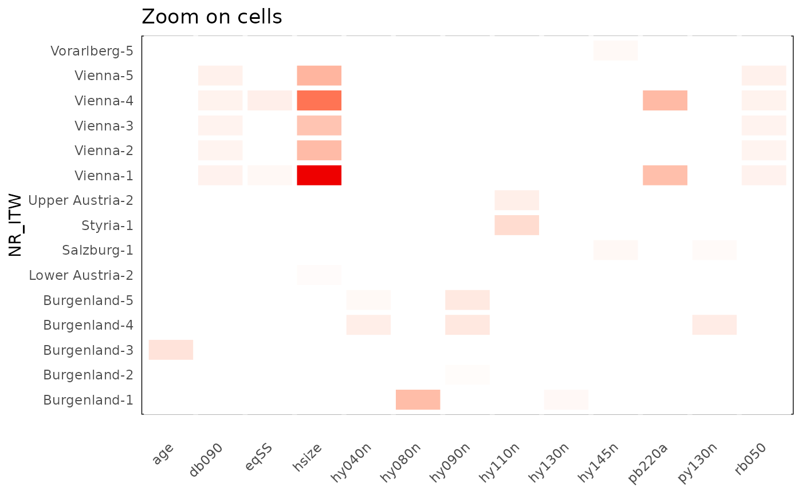
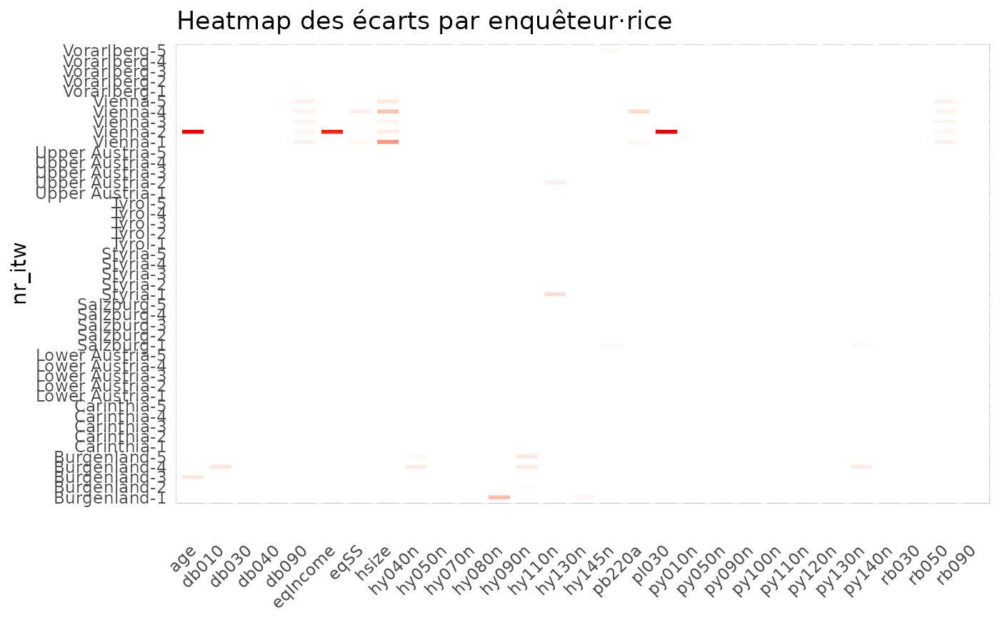

# Methodology and use of the functions

``` r

library(vizsurvey)
library(isotree)
library(tibble)
library(dplyr)
library(tidyr)
library(plotly)
```

## Introduction

This vignette presents the methodological foundations and the
calculations performed by the {vizsurvey} package. As explained in the
first vignette, {vizsurvey} is not meant to run statistical tests or to
draw conclusions: it is above all an exploration and diagnostic tool,
positioned between data collection and analysis in the GSBPM cycle.

The calculations carried out in {vizsurvey} rely on simple but robust
measures, such as distances, ranks, standard deviations or relative gaps
between distributions. These measures serve as visual cues to identify
possible inconsistencies: abnormal variations from one wave to the next,
gaps between interviewers, abrupt changes in distribution, or unexpected
increases in the non-response rate.

All the functions used in {vizsurvey} were designed to be applicable to
any type of variable, whether categorical (codes, categories,
multiple-choice answers) or numeric (continuous values, durations, ages,
incomes). The aim is to provide a generic, reproducible and robust
computation framework that ensures the comparability of results across
surveys and survey waves. Priority is given to the stability of the
indicators and to the simplicity of the formulas, so as to make them
easy to read and to adopt for field teams.

These methodological choices are not set in stone: they were
progressively refined within Statbel, based on the first results
produced by the interface. Feedback from survey managers, exchanges
between departments, and several references from the survey-quality
literature have guided the evolution of the functions.

Publishing this package is a way to share these choices. By making the
formulas, functions and computation logic public, we aim to promote
transparency, encourage reuse and stimulate contributions from other
teams facing similar issues. Our ambition is to build, together with
other statistical institutes and polling organisations, a common base of
tools and practices for survey monitoring.

The examples provided in this vignette are based on the `eusilc` dataset
from the {laeken} package. This file does not contain an interviewer
identifier, so we create one from the province variable. This lets us
simulate the presence of 45 interviewers.

``` r

library(laeken)
data(eusilc)
set.seed(123)
eusilc$NR_ITW <- paste(eusilc$db040, sample(1:5, nrow(eusilc), replace = T), sep = "-")

table(eusilc$NR_ITW)
#> 
#>    Burgenland-1    Burgenland-2    Burgenland-3    Burgenland-4    Burgenland-5 
#>             103             126             109             106             105 
#>     Carinthia-1     Carinthia-2     Carinthia-3     Carinthia-4     Carinthia-5 
#>             200             230             226             198             224 
#> Lower Austria-1 Lower Austria-2 Lower Austria-3 Lower Austria-4 Lower Austria-5 
#>             578             538             574             552             562 
#>      Salzburg-1      Salzburg-2      Salzburg-3      Salzburg-4      Salzburg-5 
#>             179             195             191             172             187 
#>        Styria-1        Styria-2        Styria-3        Styria-4        Styria-5 
#>             453             457             481             445             459 
#>         Tyrol-1         Tyrol-2         Tyrol-3         Tyrol-4         Tyrol-5 
#>             291             258             273             257             238 
#> Upper Austria-1 Upper Austria-2 Upper Austria-3 Upper Austria-4 Upper Austria-5 
#>             549             572             570             555             559 
#>        Vienna-1        Vienna-2        Vienna-3        Vienna-4        Vienna-5 
#>             490             482             438             438             474 
#>    Vorarlberg-1    Vorarlberg-2    Vorarlberg-3    Vorarlberg-4    Vorarlberg-5 
#>             142             165             139             148             139
```

## `classify_df()`: classify the variables

[`classify_df()`](https://tdelc.github.io/vizsurvey/reference/classify_df.md)
takes a database as input and produces a table as output, with a
category for each variable: “Solo” if the variable contains only one
category; “Modal” when the variable contains at most 15 categories;
“Continuous” when the variable is numeric with more than 15 categories;
“Text” otherwise. The number of categories used to choose the variable’s
category can be set with the `threshold` parameter (15 by default).

This function guides the {vizsurvey} analysis in choosing the indicators
for each variable. You can let the function decide the category of your
variables on its own, or force the category of certain variables
yourself with `config.txt` (see vignette 2).

``` r

classify_df(eusilc)
#> # A tibble: 29 × 2
#>    variable type      
#>    <chr>    <chr>     
#>  1 NR_ITW   Text      
#>  2 age      Continuous
#>  3 db030    Continuous
#>  4 db040    Modal     
#>  5 db090    Continuous
#>  6 eqIncome Continuous
#>  7 eqSS     Continuous
#>  8 hsize    Modal     
#>  9 hy040n   Continuous
#> 10 hy050n   Continuous
#> # ℹ 19 more rows
```

## `prepa_stats()`: extract the aggregates

[`prepa_stats()`](https://tdelc.github.io/vizsurvey/reference/prepa_stats.md)
takes as input a database and an interviewer variable, and returns a
data.frame compiling the statistics computed for each variable, per
interviewer. You can indicate the category of each variable with the
arguments `vars_vd` (discrete variables) and `vars_vc` (continuous
variables). If both arguments are left empty, `classify_df` is run on
the database before computing the statistics.

``` r

prepa_stats(eusilc, var_intvwr = "NR_ITW")
```

### Description of the output

This function returns a long file, with one row per
interviewer/variable/indicator crossing. For each interviewer/variable
crossing, the number of rows, the number of valid (non-missing) rows and
the variable type are reported. For a given interviewer, the indicators
computed are:

- “missing”: percentage of missing values in the variable;
- “presence”: an indicator of whether at least one value is non-missing;
- “Nmod” (for categorical variables): number of categories of the
  variable;
- “chi2” (for categorical variables): distance measure of the variable
  for this interviewer relative to the full database;
- “mean” / “median” (for continuous variables): mean / median of the
  variable.

The `value` variable gives the value of the indicator for the
interviewer. The `value_ref` variable gives the value of the indicator
for the whole population. The `standard` variable is a standardisation
of the variable (detailed below).

### Computing the $`\chi^2`$

Most indicators have simple formulas. Only the “chi2” indicator deserves
particular attention. Here are the steps for computing the $`\chi^2`$:

1.  We start by computing the distribution of the variable’s categories
    over all rows, using the `list_dist` function. We build a table of
    counts per category, then convert it into proportions. We include an
    “NA” category when the variable contains missing data. Rare
    categories (less than 1%) are grouped into an “Other” category. We
    obtain an `expected_prop` object for each variable;

2.  Within each interviewer, the `my_chisq_test` function identifies the
    missing values and the rare categories (listed in the previous step)
    in order to group them;

3.  We compare the interviewer’s distribution with that of the full
    population, using `stats::chisq.test(obs, p = exp_prop)`.

Grouping categories below 1% avoids visual noise and irrelevant
comparisons. Treating missing data as a dedicated category makes it
possible to track non-responses on the same footing as valid responses.

Here, an interviewer is partly compared with themselves, because the
overall distribution is computed only once. This can be a problem if the
interviewer has too much influence on the full database. We made this
choice to limit computation time. Only one distribution has to be
computed per variable, and {vizsurvey} then makes it possible to break
these calculations down by wave and by filter.

### Standardising the indicators

The standardisation of the indicators is performed with the `scale_IQR`
function. The function aims to bring numeric variables onto a comparable
scale, but replaces the usual standard deviation with the interquartile
range (IQR). It is therefore a robust normalisation, less sensitive to
extreme values than the usual standardisation. It is designed to fall
back on the classic `scale` standardisation in exceptional situations:
missing values, lack of variability, or data bounded between 0 and 1.

## `heatmap_group()`: customise the visualisation

You can generate the heatmap outside the interactive {vizsurvey}
interface. The `heatmap_group` function requires a data.frame produced
by `prepa_stats` and returns a ggplot with one row per interviewer and
one column per variable. The function uses all the indicators available
for a given variable to determine the colour intensity of the cell. If
you want to limit the analysis to certain indicators, filter the output
of `prepa_stats` before computing the heatmap.

By default, cells are displayed when the standardised gap exceeds 5; you
can change this threshold with the `threshold` argument. The colour goes
from white to the colour selected by the `color` argument (red by
default), on a scale from the threshold to twice that value. This way,
an excessively large gap does not hide the other gaps.

``` r

df_stats_eusilc <- prepa_stats(eusilc, "NR_ITW")

heatmap_group(df_stats_eusilc, threshold = 1, color = "green2") +
  ggtitle("eusilc heatmap")
```



``` r

df_stats_eusilc %>% 
  filter(stat == 'chi2') %>% 
  heatmap_group(threshold = 1, color = "purple2") +
  ggtitle("Heatmap of eusilc chi²")
```



You can also zoom into the heatmap, again by filtering the data.frame
produced by `prepa_stats`. Here are the three examples used in the
interactive interface:

``` r

threshold <- 3

df_stats_eusilc %>%
  group_by(NR_ITW) %>%
  filter(max(abs(standard), na.rm = TRUE) > threshold) %>%
  ungroup() %>% 
  heatmap_group(threshold) +
  ggtitle("Zoom on rows")
```



``` r

df_stats_eusilc %>%
  group_by(variable) %>%
  filter(max(abs(standard), na.rm = TRUE) > threshold) %>%
  ungroup() %>% 
  heatmap_group(threshold) +
  ggtitle("Zoom on columns")
```



``` r

df_stats_eusilc %>%
  group_by(NR_ITW, variable) %>%
  filter(max(abs(standard), na.rm = TRUE) > threshold) %>%
  ungroup() %>% 
  heatmap_group(threshold) +
  ggtitle("Zoom on cells")
```



The ggplot object produced by `heatmap_group` embeds tooltips that can
be activated with {plotly}.

``` r

p <- df_stats_eusilc %>%
  heatmap_group(3) +
  ggtitle("Interactive heatmap")

ggplotly(p, tooltip = "text")
```

## `score_isoforest()`: rank the atypical profiles

The `score_isoforest` function aims to detect atypical observations in a
multivariate dataset, relying on the [Isolation
Forest](https://cran.r-project.org/web/packages/isotree/vignettes/An_Introduction_to_Isolation_Forests.html)
method. This is an unsupervised learning algorithm, particularly useful
for spotting individuals or records whose profile differs sharply from
the rest of the population. This function is designed to be applied to a
set of numeric variables describing the same type of statistical unit
(here, interviewers), and returns an isolation score for each
observation.

We propose applying the method to the indicators computed for each
variable by the `prepa_stats` function. For now, we keep the
standardised values of the $`\chi^2`$ for categorical variables and of
the medians for continuous variables. The `score_isoforest` function
requires a wide file, so we pivot the indicators before applying it.

``` r

df_prepa <- df_stats_eusilc %>%
  filter(stat %in% c("chi2", "median")) %>%
  select(NR_ITW, variable, standard) %>%
  pivot_wider(
    id_cols = NR_ITW,
    names_from = variable,
    values_from = standard
  ) %>% 
  column_to_rownames(var = "NR_ITW")

head(sort(score_isoforest(df_prepa), decreasing = T))
#>     Vienna-4     Vienna-1 Burgenland-3     Vienna-3     Vienna-5 Burgenland-2 
#>    0.6049549    0.5993725    0.5766785    0.5636250    0.5594056    0.5437896
hist(score_isoforest(df_prepa))
```



If an optional interviewer summary file has been supplied (one row per
interviewer, see the first vignette), its standardised indicators are
appended as additional columns to this wide table, so that
interviewer-level anomalies (for example an unusually short average
interview duration or an extreme response rate) are scored together with
the distributional ones.

We again find the interviewers from the province of Vienna coming out on
top. A threshold of 0.5 seems acceptable to decide that a score reveals
an anomaly, according to [this
article](https://scispace.com/pdf/an-in-depth-study-and-improvement-of-isolation-forest-204k9g39.pdf).
Once again, {vizsurvey} does not aim to propose a single threshold, but
rather a ranking to guide the investigation.

## Conclusion

All the functions presented in this vignette rest on a simple idea: make
the weak signals in survey data visible, without over-interpreting them.
By combining robust indicators (interquartile ranges, $`\chi^2`$,
isolation scores) and intuitive visual representations (heatmaps,
rankings), the tool makes it possible to quickly spot unexpected gaps,
whether they are due to data-entry problems, interpretation errors,
context effects or real phenomena.

The goal of {vizsurvey} is also collaborative. By documenting the
formulas and making the methods transparent, we want to encourage
discussion around the monitoring of survey data, share good practices
and pave the way for collective improvements. The methodological choices
presented here are not a definitive standard, and will evolve based on
feedback on the package.
