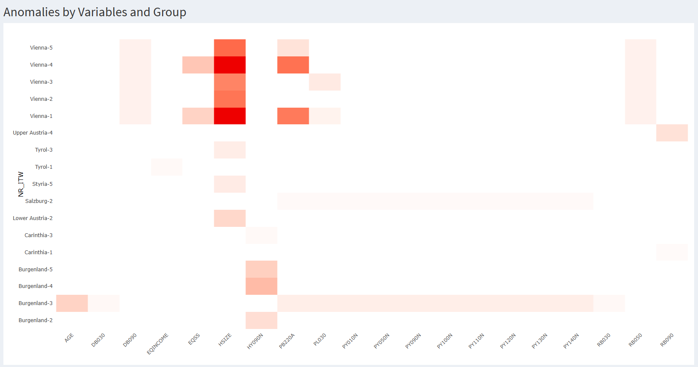
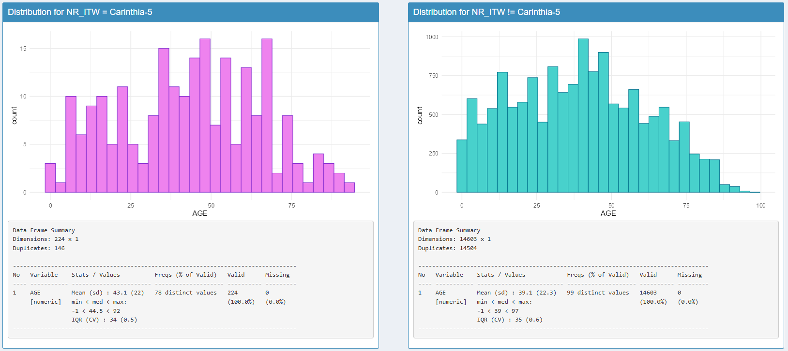
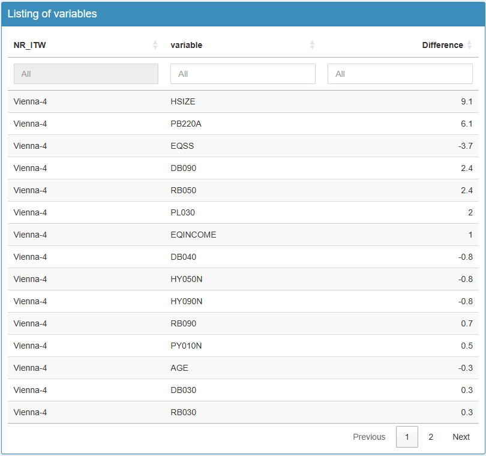
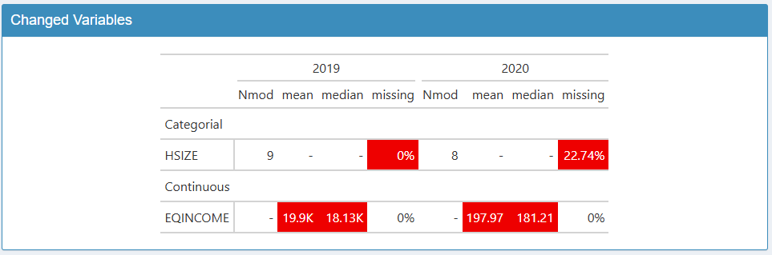

# Guide pas à pas pour fouiller et détecter les anomalies

## Introduction

### Pourquoi vizsurvey ?

Dans un processus statistique conforme au GSBPM, la qualité ne se joue
pas uniquement en amont (échantillonnage, questionnaire, collecte) ni en
aval (analyse, diffusion). Entre collecte et analyse, une phase clé
consiste à contrôler et monitorer le matériau collecté pour repérer
rapidement les anomalies, documenter les écarts et, si nécessaire,
déclencher des actions correctrices.

{vizsurvey} répond à cette problématique : il offre une interface
interactive pour parcourir vos données, comparer des profils de réponses
et prioriser les investigations. L’objectif n’est pas de conclure
statistiquement, mais de guider le regard de l’analyste avec des
indicateurs simples (distances, rangs) et des visualisations adaptées.

### Cohérence par enquêteur·rice

Le rôle des enquêteur·rices est central : compréhension fine du
questionnaire, respect du routing, gestion de l’entretien. Il peut
néanmoins apparaître des effets enquêteur (différences systématiques de
distribution des réponses selon la personne qui interroge), dus à des
méthodes de travail différentes, des biais involontaires, des erreurs
récurrentes ou, plus rarement, à de la fraude.

Sur ce sujet, {vizsurvey} permet de :

- Comparer les distributions de réponses d’un·e enquêteur·rice à tous
  les autres ;
- Classer les personnes selon plusieurs indicateurs de distance ;
- Focaliser l’examen sur les combinaisons enquêteur·rice × variable les
  plus atypiques.

### Cohérence par vague d’enquête

D’une année à l’autre, les questionnaires évoluent (libellés, routing,
filtres), mais les variables cibles doivent rester comparables.
{vizsurvey} permet de définir une variable de vague (ici par exemple
l’année de l’enquête), permettant de mettre en évidence :

- les écarts de distributions ou de niveaux (proportions, moyennes) ;
- les variables présentant des ruptures qui méritent une relecture (mise
  en œuvre du routing, recodage, version du questionnaire, changement de
  collecte, etc.).

## Lancement de vizsurvey

Il y a trois manières de lancer {vizsurvey} : à partir d’une base de
données en R (`runVizsurvey_from_r`), à partir d’un fichier csv
(`runVizsurvey_from_file`), ou en préparant une structure de fichiers
pour analyser en simultané plusieurs enquêtes
(`runVizsurvey_from_folder`).

### À partir d’un objet R

Pour lancer l’interface à partir d’un objet R, il suffit d’appeler la
fonction `runVizsurvey_from_r` avec le nom de l’objet.

``` r
knitr::opts_chunk$set(warning = FALSE, message = FALSE)
library(vizsurvey)
# Not Work
runVizsurvey_from_r(df)
```

Si vous avez lancé les packages nécessaires, une interface {shiny} se
lance dans votre navigateur. Cette interface est pratiquement vide, car
vous n’avez renseigné aucun argument, comme une variable identifiant les
groupes d’analyse (ici les enquêteur·rices), ou une pour identifier les
vagues d’enquête ou la zone géographique. Voici la commande pour
intégrer ces paramètres.

``` r
# Not Work
runVizsurvey_from_r(df,
                    var_group = "NR_ITW",
                    var_wave  = "YEAR",
                    var_zone  = "REGIO")
```

### À partir d’une base de données brute

{vizsurvey} peut aussi être utilisé à partir d’un fichier brut, en csv,
ou tout autre format lisible par la fonction `fread` du package
{data.table}. La commande est similaire à celle pour un objet R :

``` r
# Not Work
runVizsurvey_from_file(path,
                       var_group = "NR_ITW",
                       var_wave  = "YEAR",
                       var_zone  = "REGIO")
```

### À partir d’un répertoire de bases de données

Le package {vizsurvey} peut gérer plusieurs répertoires contenant
différentes enquêtes. Dans ce type de configuration, on part du principe
que plusieurs utilisateur·rices exploitent {vizsurvey} à différents
moments. Or, la génération des statistiques à chaque lancement de
l’application peut s’avérer trop longue. Il est donc préférable de
préparer les fichiers en amont, afin de rendre l’ouverture de
l’interface plus fluide.

Chaque enquête (et donc chaque dossier de base de données) doit contenir
un fichier global de configuration au format .rds. Pour lancer
l’interface, il suffit ensuite d’indiquer le répertoire source des
données, et le nombre de sous répertoires présents (1 si le répertoire
contient une enquête, 2 si plusieurs répertoires sont présents, 3 si
plusieurs répertoires contiennent eux mêmes plusieurs répertoires
d’enquête). La
[vignette](https://tdelc.github.io/vizsurvey/articles/data-preparation.html)
sur la préparation des données vous explique tout cela en détail. Voici
par exemple la commande pour une structure comportant 2 niveaux de
répertoire et 1 niveau pour les fichiers.

``` r
runVizsurvey_from_folder("data",depth_folder = 3)
```

## Analyse de la cohérence par groupe

L’analyse de la cohérence par groupe permet d’identifier d’éventuelles
anomalies de collecte en comparant systématiquement un groupe à la
population complète pour un ensemble d’indicateurs clés (valeurs
manquantes ou atypiques, distributions des réponses).

Ici, un groupe peut être un·e enquêteur·rice. Cela permet d’évaluer la
qualité et la régularité des données collectées selon la personne ayant
mené les entretiens. Dans une enquête, chaque enquêteur·rice constitue
une source potentielle de variabilité non due à l’échantillonnage mais à
des effets d’enquête : différences d’interprétation du questionnaire,
stratégies de réponse, ou biais de saisie. Mais aussi de détecter des
profils de collecte homogènes suggérant une bonne application du
protocole.

Ces comparaisons de groupe peuvent être étudiées par zone, souvent pour
se limiter à des zones géographiques où les profils d’enquêté·es sont
proches. Lorsqu’une variable de zone est indiqué, l’analyse de la
cohérence par groupe se fait au niveau global et dans chaque zone.

### Données d’exemples

Le package {laeken} fournit un fichier d’exemple de l’enquête SILC. Nous
pouvons prendre ce fichier comme exemple, et venir créer un faux numéro
d’enquêteur·rice à partir de la variable de province `DB040`. Nous
exécutons la fonction `runVizsurvey_from_r` avec comme argument
supplémentaire `var_zone = "DB040"` afin de prévoir l’analyse par
province.

``` r
knitr::opts_chunk$set(warning = FALSE, message = FALSE)
data(eusilc) 
set.seed(123) 
eusilc$NR_ITW <- paste(eusilc$db040,sample(1:5,nrow(eusilc),replace = T),sep="-") 
runVizsurvey_from_r(eusilc,var_group = "NR_ITW",var_zone = "db040")
```

Le premier onglet de {vizsurvey} permet de naviguer de manière
interactive à travers les situations détectées comme anormales
concernant les enquêteur·rices.


### Analyse de la carte de chaleur

Chaque ligne est un ou une enquêtrice. Ici, nous reconnaissons les
provinces autrichiennes avec un index, issu de notre création d’un
numéro d’enquêteur·rice. Chaque colonne est une variable, catégorielle
ou continue. Chaque cellule est colorée si les réponses de
l’enquêteur·rice pour cette variable est suffisamment différente des
réponses du reste de la base de données.

Pour les variables catégorielles, il peut s’agir d’un écart trop
important sur le pourcentage de données manquantes, ou d’un $\chi ²$
trop élevé (donc d’une distribution très éloignée du reste de la base de
données). Pour les variables numériques, il peut s’agir d’un écart trop
important sur le pourcentage de données manquantes ou sur la médiane.
Dans les deux cas, ces écarts sont normalisés par variable avant
affichage, et la cellule s’affiche si l’écart dépasse cinq écarts-types
pour cette variable. Le détail méthodologique sur les calculs effectués
se trouve dans une vignette dédiée.

En survolant les cellules, toutes les informations sont affichées, de
sorte à comprendre la source de la coloration. Voici une première
manière d’analyser la carte de chaleur :

- Une cellule isolée rouge n’est pas problématique en soi : avec
  beaucoup de croisements, il est normal d’observer quelques extrêmes.

- Une ligne régulièrement rouge (sur plusieurs variables) évoque un
  comportement récurrent (erreur de procédure, incompréhension, routage
  mal appliqué, voire fraude).

- Une colonne rouge (sur plusieurs enquêteur·rices) pointe une variable
  fragile (libellé ambigu, routing, effet d’une zone).

Par défaut, la carte de chaleur affiche une cellule en rouge lorsque
l’un des écarts dépasse 5 écart-type de la variable. Dans notre
situation, cela conduit à afficher 7 cellules, toutes pour Vienne. En
réduisant le seuil de sensibilité dans les paramètres, on affiche bien
plus de cellules. Il n’y a pas de seuil prédéterminée, ou
statistiquement valide, pour une telle analyse. Cela doit être déterminé
par tâtonnement par l’équipe en charge de la coordination de l’enquête.
Il est également possible de modifier le nombre de lignes minimum (donc
d’enquêtes) pour afficher la ligne, ou le nombre de valeurs non
manquantes nécessaires pour l’affichage d’une cellule.

Enfin, il est possible de zoomer
dans la carte de chaleur, sur les lignes, les colonnes, ou sur les
cellules à risque. Cela permet, lorsque la carte de chaleur est trop
vaste, de cibler plus efficacement les situations à analyser. Voici par
exemple la même carte de chaleur pour une sensibilité de deux écart-type
avec un zoom sur les cellules à risque. On voit que d’autres cellules
apparaissent suite à la hausse de sensibilité, mais que certain·es
enquêteur·rices ont disparu, car n’affichant aucune cellule rouge.



### Analyse d’une variable catégorielle

Dans notre exemple, avec une sensibilité de 5 écart-type, sept cellules
s’allument en rouge pour la région de Vienne. En cliquant sur le
croisement Vienne-1 / HHSIZE, on peut afficher la distribution de cette
variable HHSIZE pour l’enquêteur Vienne-1, et la comparer avec la
distribution de cette variable pour les autres. Un résumé statistique de
la variable est disponible en dessous à l’aide du package
`summarytools`.

On découvre ainsi que les modalités 3 et 4 de la variable HHSIZE sont
bien moins présentes chez l’enquêteur Vienne-1 que chez les autres.

 Pour essayer de comprendre ces
différences, nous avons inclus un algorithme qui calcule les dix
corrélations les plus hautes dans la base de données, pour ensuite
projeter les corrélations effectives pour l’enquêteur·rice et celles du
reste de la base de données. Il s’agit uniquement de corrélations de
pearson en transformant au préalable les variables catégorielles en
facteur.

> **Principe directeur** : aucun test statistique n’est effectué.
> {vizsurvey} calcule des distances, des scores, des rangs et des
> corrélations destinés à **prioriser** la revue. Les conclusions
> analytiques restent du ressort de l’équipe méthodologique.

Pour notre enquêteur Vienne-1 et son résultat surprenant pour la
variable HHSIZE, on observe que les corrélations de cette variable sont
identiques chez lui et pour le reste de la base de données. Cela semble
écarter l’hypothèse d’une anomalie spécifique à cette variable.


Pour revenir sur la carte de chaleur, on remarque que les cinq cellules
de Vienne sont allumées en rouge pour la variable HHSIZE, preuve d’un
effet de zone plutôt qu’un effet d’enquêteur·rice. Pour s’en convaincre,
on peut sélectionner DB040 = Vienne en haut de l’interface. Dès lors, la
carte de chaleur se limite aux données de Vienne, et n’affiche que les
écarts des enquêteur·rices par rapport à cette province. Et ainsi, il
n’y a plus aucune cellule s’affichant en rouge.


### Analyse d’une variable continue

Lorsqu’on clique sur une variable continue, la fonction de densité
s’affiche alors, toujours avec le point de comparaison entre
l’enquêteur·rice, et le reste de la base de données. Dans notre cas
Voici un exemple pour la variable d’âge pour l’enquêtrice Carinthia-5 :



### Synthèse des anomalies

Quand le volume de croisements est important, il est difficile de savoir
où commencer sur la carte de chaleur. {vizsurvey} propose un classement
des enquêteur·rices avec un modèle Isolation Forest appliqué aux
vecteurs de χ² pour les variables catégorielles et de médianes pour les
variables continues.

La méthode [Isolation
Forest](https://cran.r-project.org/web/packages/isotree/vignettes/An_Introduction_to_Isolation_Forests.html)
est une technique d’apprentissage automatique non supervisée utilisée
pour établir un classement de rareté des observations. Elle repose sur
une idée simple : les observations inhabituelles sont plus faciles à
isoler que les observations “normales”. Concrètement, l’algorithme
construit de nombreux arbres de décision aléatoires : à chaque nœud, une
variable et une valeur de coupure sont choisies au hasard pour diviser
l’échantillon. Une observation est isolée lorsqu’elle se retrouve seule
dans une branche. Les observations anormales nécessitent donc moins de
divisions pour être isolées. Le score d’isolation obtenu peut ensuite
être utilisé pour établir un rang.

> *Important* : ce classement n’est pas une preuve. Il **priorise**
> l’audit (lecture ciblée des variables responsables, vérification du
> contexte terrain).

Voici le classement des enquêteur·rices issue de la carte de chaleur. On
retrouve enquêteur·rices de province de Vienne, mais aussi d’autres de
la province de la basse et la haute Autriche. Pour ces deux derniers
cas, il n’y a pas d’écarts au dessus du seuil de sensibilité, mais
l’isolation se fait rapidement.


En cliquant sur un·e enquêteur·rice, on obtient un deuxième tableau à
droite avec la liste des variables. Voici l’illustration en cliquant sur
l’enquêtrice Vienna-4. Cela permet d’orienter l’analyse en commençant
par les variables les plus marquantes. En cliquant sur une variable, on
obtient en dessous les graphiques d’analyse comme durant la carte de
chaleur.



### Résumé : analyse pas à pas

1.  **Sélectionner** l’enquête.
2.  **Choisir** l’onglet *Enquêteurs*.
3.  **Filtrer** la base de données selon une vague et une zone en
    particulier, et ajuster les paramètres d’affichage.
4.  **Parcourir la heatmap** pour repérer les zones les plus rouges.
5.  **Cliquer** sur une cellule pour ouvrir les détails (distribution,
    corrélation).
6.  **Comparer** à la référence et regarder la cohérence intra-variable
    (modalités) et inter-variables (corrélations).
7.  **Consigner** les cas récurrents (mêmes écarts sur plusieurs
    variables ou dans le temps).

## Analyse de la cohérence par vague d’enquête

L’analyse de la cohérence par vague d’enquête vise à vérifier la
stabilité des indicateurs clés dans le temps et à détecter d’éventuelles
ruptures liées à des changements de collecte, de pondération ou de
comportement des unités répondantes. Toutes les variables sont examinées
d’une vague à une autre (souvent d’une année sur l’autre) afin
d’identifier les variations anormalement fortes qui ne s’expliqueraient
pas par l’évolution réelle du phénomène observé. Cette approche permet
de distinguer les fluctuations statistiques attendues (échantillonnage,
conjoncture, etc.) des sauts incohérents suggérant une erreur de codage
ou de définition. L’objectif est de garantir la continuité temporelle
des séries.

Ces variations entre vague peuvent être étudiées par zone, souvent pour
se concentrer sur des zones géographiques, ou par exemple des trimestres
d’enquête. Lorsqu’une variable de zone est indiquée, l’analyse de la
cohérence par vague d’enquête se fait au niveau global et dans chaque
zone.

### Données d’exemples

Nous repartons du fichier `eusilc` du package {laeken}, et créons une
fausse vague d’enquête. Nous allons créer une variable d’année aléatoire
entre 2010 et 2020, et provoquer quelques erreurs à détecter pour
l’année 2020 : la variable `pb220a` sera manquante, la modalité 4 de la
variable `hsize` n’existera pas, et la variable de revenu équivalent
moyen `eqIncome` sera à la mauvaise échelle.

``` r
data(eusilc)

# Générer la variable d'année
set.seed(123) 
eusilc$YEAR <- sample(2010:2020,nrow(eusilc),replace=T)

# Générer les erreurs
eusilc[eusilc$YEAR == 2020,"pb220a"] <- NA
eusilc[eusilc$YEAR == 2020 & eusilc$hsize == 4,"hsize"] <- NA
eusilc[eusilc$YEAR == 2020,"eqIncome"] <- eusilc[eusilc$YEAR == 2020,"eqIncome"] / 100

runVizsurvey_from_r(eusilc,var_domain = "YEAR",var_group = "db040")
```

Le deuxième onglet de {vizsurvey} permet de naviguer de manière
interactive à travers les situations détectées comme anormales
concernant les vagues.

### Analyse des changements sur les variables

Le tableau de droite indique les variables ayant apparu ou disparu entre
les vagues. On retrouve ici la variable `pb220a` que nous avons supprimé
pour l’année 2020.


Le tableau de gauche indique les variables ayant connu une variation
notable. Chaque ligne est une variable ayant connu un changement entre
deux modalités de la vague. Par défaut, la vague de référence est la
dernière modalité de la variable (ici 2020 pour l’année), et la
comparaison se fait avec l’avant dernière modalité (ici 2019). Vous
pouvez changer de modalité de référence, ou ajouter des modalités de
comparaison. Attention, la lecture du tableau est peu lisible au delà de
deux modalités de comparaison. Les cellules sont colorées lorsque
l’écart est suffisamment élevé.



Pour les variables catégorielles, il peut s’agir d’un écart trop
important sur le pourcentage de données manquantes ou sur le nombre de
modalités. Ici, on retrouve la variable `HSIZE` qui voit une hausse de
données manquantes. Pour les variables continues, il peut s’agir d’un
écart trop important sur le pourcentage de données manquantes, la
moyenne ou sur la médiane. Ici, on retrouve la variable `EQINCOME` avec
l’erreur de milliers.

Ce seuil de sensibilité peut être modifié, affichant plus ou moins de
variables. Il est également possible de faire varier du nombre de
valeurs non manquantes nécessaire pour inclure la variable dans
l’analyse.

### Analyse graphique

Pour chaque variable détectée dans cet onglet, des graphiques sont
accessibles dans l’onglet *Graphics* pour mieux comprendre les écarts
entre vagues. Le graphique de gauche illustre la distribution de la
variable pour le vague de référence. Le graphique de droite illustre la
comparaison entre les vagues sélectionnés.

Voici l’exemple pour la variable catégorielle `HSIZE` On détecte
automatiquement la part de données manquantes importante en 2020.


Voici l’exemple pour la variable continue `EQINCOME` On détecte
automatiquement la différence d’échelle des deux distributions.


### Résumé : analyse pas à pas

1.  **Sélectionner** l’enquête et la période.
2.  **Choisir** l’onglet *Wave*.
3.  **Filtrer** la base de données selon une zone en particulier, et
    ajuster les paramètres d’affichage.
4.  **Lister** les variables ayant apparu et disparu et vérifier si cela
    est justifiable.
5.  **Parcourir** les variables ayant changé, pour vérifier chaque écart
    en rouge.
6.  **Analyser** ces variables à l’aide des graphiques.
7.  **Consigner** les cas problématiques (nouvelle modalité,
    distribution très différente, etc.).

## Conclusion

L’analyse de la cohérence par groupe ou par vague d’enquête constitue
une étape essentielle du contrôle qualité d’une enquête, mais elle ne
vise pas à produire des jugements automatiques. L’outil {vizsurvey}
n’infère rien : il organise l’exploration et met en évidence les
régularités, écarts ou incohérences susceptibles d’attirer l’attention
du service de coordination du terrain. L’interprétation des résultats
doit toujours s’appuyer sur le contexte opérationnel : les consignes
données aux enquêteur·rices, les conditions de collecte, etc. Ces
éléments seuls permettent de distinguer une vraie anomalie d’un simple
effet de structure.

De plus, les informations mobilisées concernent parfois des données
sensibles, tant sur les enquêteur·rices que sur les ménages interrogés ;
elles doivent donc être traitées dans le strict respect des règles de
confidentialité et de protection des données personnelles en vigueur.
Quiconque utilise {vizsurvey} doit, de notre point de vue, être soumis
aux mêmes règles de confidentialité que celles s’appliquant aux fichiers
de données sources. En effet, l’anonymisation n’est en aucun cas
garantie dans l’interface : les croisements, filtres ou visualisations
proposés peuvent révéler indirectement des informations individuelles ou
des identifiants d’enquêteur·rices. L’accès à {vizsurvey} doit donc être
réservé aux personnes autorisées à consulter les données détaillées,
dans un cadre sécurisé et conforme aux politiques internes de gestion
des données.

En résumé, {vizsurvey} est un outil d’aide à l’analyse en complément de
ceux actuellement utilisés par les équipes d’enquête, et non un outil de
diagnostic automatique. Il permet de rendre visibles les comportements
de collecte et d’outiller les équipes d’enquête, mais les conclusions
finales relèvent toujours du jugement éclairé de ces équipes.
