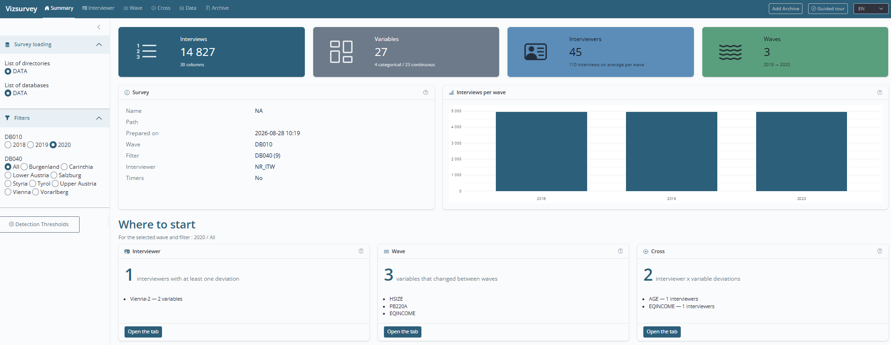
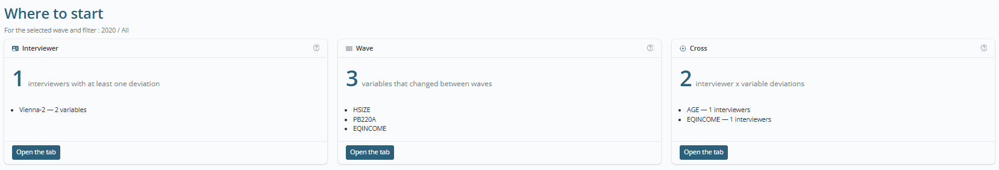
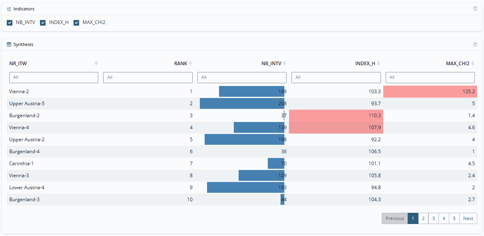
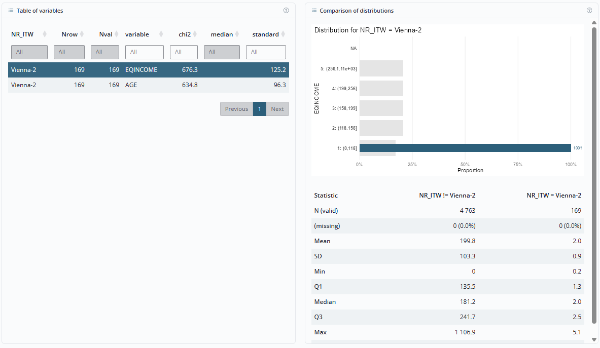
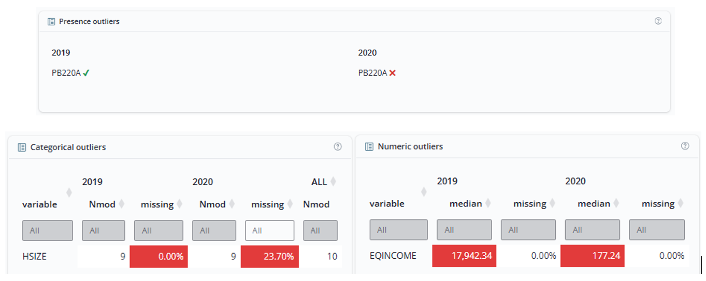
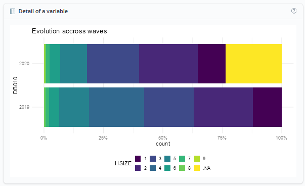
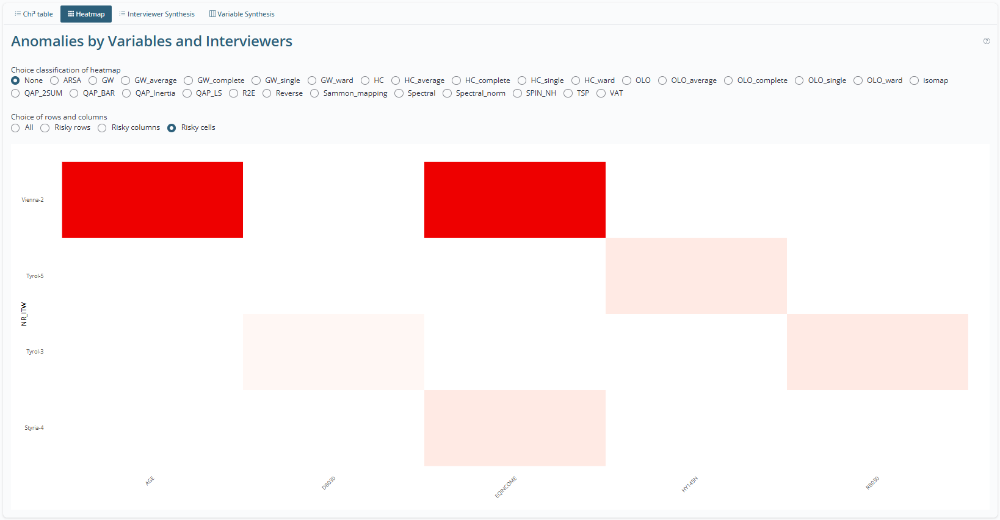

# Guide pas à pas : explorer et détecter les anomalies

## Introduction

### Pourquoi vizsurvey ?

Dans un processus statistique, la qualité ne se joue pas seulement en
amont (échantillonnage, questionnaire, collecte) ou en aval (analyse,
diffusion). Entre la collecte et l’analyse se situe une phase clé : le
contrôle et le suivi du matériau collecté, pour repérer rapidement les
anomalies, documenter les écarts et, si nécessaire, déclencher une
action corrective durant le travail de terrain.

{vizsurvey} répond à ce besoin : une interface interactive pour
parcourir vos données, comparer des profils de réponse et prioriser les
investigations. L’objectif n’est pas de tirer des conclusions
statistiques, mais de guider l’œil de l’analyste avec des indicateurs
simples (distances, rangs) et des visualisations adaptées.

### La cohérence entre enquêteur·rices

Le rôle de l’enquêteur·rice est central : compréhension fine du
questionnaire, respect du routage, conduite de l’entretien. Des effets
enquêteur·rice peuvent néanmoins apparaître (des différences
systématiques de distribution des réponses selon la personne qui conduit
l’entretien), issus de méthodes de travail différentes, de biais
involontaires, d’erreurs récurrentes ou, plus rarement, de fraude.

Sur ce volet, {vizsurvey} permet de :

- comparer les distributions de réponse d’un·e enquêteur·rice à celles
  de tous les autres ;
- classer les enquêteur·rices selon un score d’anomalie ;
- concentrer la relecture sur les croisements enquêteur·rice × variable
  les plus atypiques ;
- si un audit trail (timers) est disponible, examiner les durées
  d’entretien, le travail de nuit ou les entretiens trop rapprochés. Le
  travail sur l’audit trail est en refonte pour être le plus facilement
  accessible pour tous les instituts.

### La cohérence entre vagues

D’une vague à l’autre, les questionnaires évoluent (libellés, routing,
filtres), mais les variables cibles doivent rester comparables.
{vizsurvey} permet de définir une variable de vague (par exemple l’année
de l’enquête) et met en évidence :

- les écarts de distribution ou de niveau (proportions, médianes) ;
- les variables présentant des ruptures qui méritent un second regard
  (recodage, version du questionnaire, changement de mode de collecte,
  etc.).

Depuis la version 0.4, la vague peut être définie sur **deux niveaux**
(par exemple l’année et le trimestre) : le premier niveau est
obligatoire pour obtenir l’analyse, le second facultatif.

## Lancer vizsurvey

Il existe deux manières principales de lancer {vizsurvey} : depuis une
base présente en R (`runVizsurvey_from_r`), ou en préparant une
arborescence de fichiers pour analyser plusieurs enquêtes à la fois
(`runVizsurvey_from_folder`).

### Depuis un objet R

Pour lancer l’interface depuis un objet R, il suffit d’appeler
`runVizsurvey_from_r` avec le nom de l’objet.

``` r

library(vizsurvey)
# Not Run
runVizsurvey_from_r(df)
```

À ce stade, l’interface est presque vide : vous n’avez fourni aucun
paramètre, comme une variable identifiant les enquêteur·rices, une
variable de vague, ou une variable de filtre. Voici la commande complète
:

``` r

# Not Run
runVizsurvey_from_r(df,
                    var_intvwr = "NR_ITW",
                    var_wave   = "YEAR",
                    var_filter = "REGIO")
```

Ici, `var_intvwr` identifie les enquêteur·rices, `var_wave` identifie
les vagues, et `var_filter` est une variable facultative servant à
**filtrer** l’analyse (par exemple la région). Quand un filtre est
fourni, les analyses sont produites à la fois au niveau global et au
sein de chaque modalité du filtre.

`var_wave` et `var_filter` acceptent chacun **deux variables** : la
seconde est alors un second niveau, emboîté dans le premier.

``` r

# Not Run
runVizsurvey_from_r(df,
                    var_intvwr = "NR_ITW",
                    var_wave   = c("YEAR", "QUARTER"),
                    var_filter = "REGIO")
```

À noter : les noms de variables sont traités sans tenir compte de la
casse (tout est converti en majuscules en interne).

### Depuis une arborescence de dossiers

{vizsurvey} peut gérer plusieurs dossiers contenant différentes
enquêtes. Dans ce type d’organisation, l’hypothèse est que plusieurs
personnes utilisent {vizsurvey} à des moments différents. Comme le
calcul des statistiques à chaque ouverture serait trop lent, on prépare
les fichiers à l’avance avec
[`prepa_survey()`](https://tdelc.github.io/vizsurvey/reference/prepa_survey.md)
: l’ouverture de l’interface est alors immédiate.

Chaque enquête (donc chaque dossier de données) doit contenir un fichier
de configuration `config.txt` et un fichier `global.rds` généré par la
préparation. La [vignette de préparation des
données](https://tdelc.github.io/vizsurvey/articles/data-preparation.html)
détaille tout cela. Voici par exemple la commande pour une structure à
deux niveaux de dossiers :

``` r

runVizsurvey_from_folder("data", depth_folder = 2)
```

Cette fonction accepte aussi trois fichiers, décrits dans la [vignette
de présentation des
meta-données](https://tdelc.github.io/vizsurvey/articles/metadata.html)
: un **dictionnaire** des variables (`path_dict`), une **nomenclature**
de libellés (`path_nomen`), et un fichier d’**archive** partagé
(`path_archive`).

``` r

runVizsurvey_from_folder("data", depth_folder = 2,
                         path_dict    = "meta/dictionnaire.rds",
                         path_nomen   = "meta/nomenclature.csv",
                         path_archive = "meta/archive.csv")
```

### Les données d’exemple

Le package {laeken} fournit un extrait de l’enquête SILC. La fonction
[`create_eusilc_sim()`](https://tdelc.github.io/vizsurvey/reference/create_eusilc_sim.md)
en dérive un jeu d’exemple prêt à l’emploi : elle crée un numéro
d’enquêteur·rice fictif (`nr_itw`, à partir de la province), une vague
fictive (`db010`, entre 2018 et 2020), et y **injecte des erreurs
volontaires** que l’interface doit permettre de retrouver :

- pour l’enquêteur **Vienna-2** : l’âge est divisé par 10, le revenu
  équivalent par 100, et la modalité 5 de `pl030` est remplacée par des
  valeurs manquantes ;
- pour la vague **2020** : la variable `pb220a` est manquante, la
  modalité 4 de `hsize` disparaît, et le revenu équivalent est divisé
  par 100.

``` r

library(vizsurvey)
df <- create_eusilc_sim()

runVizsurvey_from_r(df,
                    var_intvwr = "nr_itw",
                    var_wave   = "db010",
                    var_filter = "db040")
```

C’est ce jeu de données qui illustre toute la suite de cette vignette.

## Tour de l’interface



### La barre latérale

La barre latérale, à gauche, commande **tout le reste de
l’application**. On y trouve :

- le **chargement de la base** : le choix du dossier et de l’enquête (en
  mode `from_folder`) ;
- le **filtrage** : la vague et le filtre courants. Lorsque la vague a
  deux niveaux, un second sélecteur apparaît en cascade sous le premier,
  facultatif (`All` par défaut). Le filtre fonctionne de la même façon,
  avec `All` pour ne pas filtrer ;
- le bouton **Seuils de détection**, qui ouvre les paramètres de
  sensibilité.

### Les seuils de détection

Rien n’est signalé en dessous de ces seuils. Quatre paramètres sont
réglables :

| Seuil | Défaut | Rôle |
|----|----|----|
| Nombre minimum de lignes | 30 | en dessous, l’enquêteur·rice ou la variable est exclue de la détection |
| Nombre minimum de valeurs valides | 30 | en dessous, la variable est exclue de l’analyse |
| Taux de variation minimum (vagues) | 0.5 | variation relative à partir de laquelle une case devient rouge dans l’onglet Vague |
| Distance de chi² | 5 | écart standardisé à partir duquel un croisement enquêteur·rice × variable est signalé |

Il n’existe pas de seuil statistiquement fondé pour ce type d’analyse :
c’est à l’équipe de le régler par tâtonnement. Baissez-le pour voir plus
de cas, montez-le pour ne garder que les plus francs.

### L’aide contextuelle et la visite guidée

Deux dispositifs d’aide sont intégrés :

- chaque carte de l’application porte un bouton **?** qui ouvre une
  explication : ce que la carte affiche, ce que valent ses colonnes,
  comment la lire ;
- le bouton **Visite guidée**, dans la barre de navigation, déroule un
  tutoriel d’une dizaine d’étapes sur les données actuellement chargées
  : chaque étape ouvre un onglet, entoure un élément de l’écran et
  l’explique.

L’interface est disponible en français, anglais et néerlandais
(sélecteur en haut à droite). L’aide et la visite guidée suivent la
langue choisie.

## L’onglet Synthèse

C’est l’onglet d’accueil. Il répond à deux questions : *qu’est-ce qui
est chargé ?* et *par où commencer ?*

La partie haute présente l’enquête : quatre compteurs (entretiens,
variables analysées, enquêteur·rices, vagues), une présentation simple
des données (nom, chemin, date de la dernière préparation, rôle des
variables, présence des timers) et le nombre d’entretiens par vague —
découpé par le second niveau de vague quand il existe.

La partie basse, « Par où commencer », donne trois points d’entrée
chiffrés pour la vague et le filtre courants : le nombre
d’enquêteur·rices présentant au moins un écart, le nombre de variables
ayant varié entre les vagues, et le nombre de croisements enquêteur·rice
× variable au-dessus des seuils. Chaque carte liste les cinq cas les
plus marquants et un bouton ouvre l’onglet correspondant.



Sur les données d’exemple, la carte Enquêteur signale d’emblée Vienna-2.

## L’onglet Enquêteur

### La synthèse

Le tableau principal affiche une ligne par enquêteur·rice, pour la vague
et le filtre courants, classée par un **rang d’anomalie** :

- `RANK` provient d’un score d’Isolation Forest calculé sur l’ensemble
  des indicateurs : plus la combinaison d’indicateurs est rare, plus le
  rang est élevé (consultez la [vignette de présentation des méthodes de
  calcul](https://tdelc.github.io/vizsurvey/articles/methods.html) pour
  plus d’informations sur l’Isolation Forest);
- `NB_INTV` est le nombre d’entretiens, `INDEX_H` un indice
  d’homogénéité des réponses, `MAX_CHI2` le plus grand écart observé sur
  une variable ;
- si un audit trail est disponible, s’ajoutent les indicateurs de durée
  (`DURATION_*`) et les parts d’entretiens signalés (`PC_*` : nuit, trop
  courts, trop rapprochés).

Une case rouge dépasse de plus de deux écarts-types la moyenne de sa
colonne. La carte **Indicateurs**, au-dessus, permet d’écarter un
indicateur du tableau *et* du score. Ceci est utile quand un indicateur
n’a pas de sens pour votre enquête.



Si une nomenclature a été fournie (`path_nomen`), les libellés des
variables s’affichent sous les noms de colonnes.

> **Principe directeur** : aucun test statistique n’est réalisé.
> {vizsurvey} calcule des distances, des scores et des rangs destinés à
> **prioriser** la relecture. Les conclusions restent de la
> responsabilité de l’équipe.

### Le détail par variable

En cliquant sur un·e enquêteur·rice, les onglets du dessous se
remplissent. « Détail par variable » liste ses variables classées par
écart aux autres enquêteur·rices : `chi2` mesure la distance entre sa
distribution et la distribution de référence, `standard` est cette
distance normalisée par variable — c’est elle qui est comparée au seuil.

Point important : **les variables continues sont découpées en cinq
classes** (par quantiles) avant la comparaison. Toutes les variables se
lisent donc de la même façon, avec une seule distance de chi².

Un clic sur une variable affiche :

- la **comparaison des distributions** : la distribution de
  l’enquêteur·rice (en foncé) face à celle de tous les autres (en gris),
  accompagnée d’un tableau de statistiques descriptives comparées ;
- la **distribution des modalités** : pour chaque modalité, la
  distribution de sa part parmi tous les enquêteur·rices, avec une ligne
  rouge sur la valeur de l’enquêteur·rice. Elle permet d’évaluer la
  dispersion de chaque modalité, et donc si l’enquêteur·rice est
  réellement isolé·e.



Sur les données d’exemple, le revenu de Vienna-2 (multiplié par 100) se
remarque rapidement : sa densité est décalée d’un ordre de grandeur.

### Le détail par entretien (audit trail)

Quand des timers sont disponibles, cet onglet reconstitue les entretiens
de l’enquêteur·rice : durée totale, écart avec l’entretien précédent,
drapeaux 🔴 (entretien trop court, travail de nuit, plusieurs sessions,
entretiens qui se chevauchent). Un clic sur un entretien ouvre ses
sessions, puis le détail item par item. Les seuils de ces drapeaux sont
fixés à la préparation, dans `config.txt`.

### Les détails sur l’enquêteur·rice

Le dernier onglet situe l’enquêteur·rice : la répartition géographique
de ses entretiens (selon la variable `var_info_geo` du `config.txt`) et
son nombre d’entretiens par vague et par filtre, sur tout l’historique.
Un·e enquêteur·rice couvrant une zone inhabituelle peut expliquer des
écarts observés ailleurs : les répondants ne sont tout simplement pas
les mêmes.

## L’onglet Vague

### Les tableaux d’écarts

L’onglet compare la vague sélectionnée dans la barre latérale aux vagues
cochées dans « Comparer avec ». Les vagues de comparaison sont proposées
au même niveau que la sélection : des années si vous avez choisi une
année, des trimestres si vous avez choisi un trimestre.

Trois cartes structurent la lecture :

- les **variables absentes d’une vague** : cette carte n’apparaît que si
  une variable est présente dans une vague et absente d’une autre. C’est
  la première chose à vérifier : une variable absente ne peut pas être
  comparée ;
- les **variables catégorielles** qui ont bougé : une ligne par
  variable, un bloc de colonnes par vague avec la part de valeurs
  manquantes et le nombre de modalités observées. Une case devient rouge
  quand la variation dépasse le taux de variation minimum ;
- les **variables numériques** qui ont bougé : même principe, avec la
  part de manquants et la médiane.



Sur les données d’exemple, en sélectionnant la vague 2020 : `pb220a`
apparaît dans les absences, `hsize` dans les catégorielles (hausse de
valeurs manquantes), et `eqIncome` dans les numériques (médiane divisée
par 100 — un changement d’échelle typique).

### L’analyse graphique

Un clic sur une ligne remplit la carte de détail à droite :

- pour une variable catégorielle : la part de chaque modalité, vague par
  vague, les valeurs manquantes apparaissant comme une modalité `.NA`.
  Une rupture dans les bandes de couleur confirme ce que le tableau a
  signalé ;
- pour une variable numérique : la densité, une courbe par vague,
  tronquée aux 1er et 99e centiles pour que quelques valeurs extrêmes
  n’écrasent pas les courbes.



## L’onglet Croisé

C’est l’onglet le plus dense : il croise les enquêteur·rices et les
variables. Quatre sous-onglets :

- la **table de chi²** : une ligne par couple enquêteur·rice × variable
  dont l’écart dépasse le seuil, triée par écart décroissant. C’est le
  point d’entrée pour repérer les écarts les plus importants ;
- la **heatmap** : une ligne par enquêteur·rice, une colonne par
  variable, une case colorée quand l’écart dépasse le seuil. On peut
  zoomer sur les lignes à risque, les colonnes à risque ou les seules
  cases au-dessus du seuil, et réordonner lignes et colonnes par
  sériation pour regrouper les profils proches. Le survol d’une case
  affiche les valeurs sous-jacentes ;
- la **synthèse par enquêteur·rice** : le classement par score
  d’anomalie, et pour l’enquêteur·rice sélectionné·e, la liste de ses
  variables les plus contributives ;
- la **synthèse par variable** : le même classement, vu du côté des
  variables. Une variable en tête de ce tableau relève souvent d’un
  problème de questionnaire (formulation ambiguë, routing) plutôt que
  d’un·e enquêteur·rice.

En bas de page, les cartes de **comparaison des distributions** et de
**distribution des modalités** fonctionnent comme dans l’onglet
Enquêteur, dès qu’un clic sur une association enquêteur·rice × variable
a été effectué. Si un dictionnaire a été fourni, une carte affiche en
plus les entrées du dictionnaire pour la variable sélectionnée —
pratique pour vérifier la formulation exacte d’une question avant de
conclure.



La lecture de la heatmap est la plus complexe. Voici quelques conseils
de lecture :

- une case isolée n’est pas en soi un problème : avec beaucoup de
  croisements, quelques valeurs extrêmes sont normales ;
- une **ligne** régulièrement rouge suggère un comportement récurrent
  (erreur de procédure, incompréhension, routing mal appliqué, voire
  fraude) ;
- une **colonne** rouge désigne une variable à vérifier (libellé ambigu,
  routing, effet de sous-population) plutôt que les enquêteur·rices.

Pour départager un effet enquêteur·rice d’un effet de sous-population,
utilisez le filtre de la barre latérale : si les cases rouges
disparaissent une fois l’analyse restreinte à la zone de
l’enquêteur·rice, l’explication est structurelle, pas individuelle.

## Les onglets Données, Dictionnaire et Archive

- **Données** : les données telles qu’elles ont été préparées, avec une
  sélection de variables et des filtres par colonne. Utile pour vérifier
  une valeur vue dans une analyse ou comprendre comment une variable est
  codée ;
- **Dictionnaire** : cet onglet n’apparaît que si un dictionnaire a été
  fourni au lancement (`path_dict`). Il affiche le fichier tel quel,
  avec recherche et filtres ;
- **Archive** : l’historique des observations. Le bouton **Ajouter à
  l’archive** enregistre la date, l’utilisateur·rice, l’enquête, la
  vague, l’enquêteur·rice, l’entretien et la variable concernés, plus un
  commentaire libre. Le fichier est partagé par toutes les personnes qui
  utilisent le même chemin d’archive : notez aussi les fausses alertes,
  c’est ce qui évite à la personne suivante de refaire la même
  investigation.

La [vignette de
métadonnées](https://tdelc.github.io/vizsurvey/articles/metadata.html)
détaille comment intégrer ces éléments dans votre outil.

## Démarche conseillée

1.  **Sélectionnez** l’enquête, la vague et éventuellement le filtre.
2.  **Partez** de l’onglet Synthèse et vérifiez que l’importation des
    données est correct.
3.  **Vérifiez** d’abord l’onglet Vague : une variable absente ou un
    changement d’échelle expliquent souvent des écarts en cascade
    ailleurs.
4.  **Observez** le tableau des chi² de l’onglet Croisé : les dix
    premières lignes doivent trouver une explication ou être corrigée.
5.  **Parcourez** la heatmap de l’onglet Croisé : lignes rouges
    (enquêteur·rices), colonnes rouges (variables).
6.  **Cliquez** sur les cas marquants pour ouvrir les distributions, et
    comparez la forme, pas seulement l’écart.
7.  **Contrôlez** avec le filtre qu’il ne s’agit pas d’un effet de
    sous-population.
8.  **Consignez** chaque vérification dans l’Archive, y compris les
    fausses alertes.

## Conclusion

L’analyse de cohérence par enquêteur·rice ou par vague est une étape
essentielle du contrôle qualité d’une enquête, mais elle n’a pas
vocation à produire des jugements automatiques. {vizsurvey} n’infère
rien : il organise l’exploration et met en évidence les régularités,
écarts ou incohérences susceptibles d’attirer l’attention de l’équipe de
coordination. L’interprétation des résultats doit toujours s’appuyer sur
le contexte opérationnel : consignes données aux enquêteur·rices,
conditions de collecte, etc. Ces éléments seuls permettent de distinguer
une véritable anomalie d’un simple effet de structure.

Par ailleurs, les informations mobilisées concernent parfois des données
sensibles, sur les enquêteur·rices comme sur les ménages enquêtés ;
elles doivent donc être traitées dans le strict respect des règles
applicables en matière de confidentialité et de protection des données
personnelles. De notre point de vue, toute personne utilisant
{vizsurvey} doit être soumise aux mêmes règles de confidentialité que
celles qui s’appliquent aux fichiers sources. L’anonymisation n’est en
effet nullement garantie dans l’interface : les croisements, filtres ou
visualisations proposés peuvent indirectement révéler des informations
individuelles ou des identifiants d’enquêteur·rices. L’accès à
{vizsurvey} doit donc être restreint aux personnes habilitées à
consulter les données détaillées, dans un cadre sécurisé conforme aux
politiques internes de gestion des données.

En résumé, {vizsurvey} est un outil d’appui à l’analyse qui complète
ceux utilisés par les équipes d’enquête, pas un outil de diagnostic
automatique. Il rend visibles les comportements de collecte et outille
les équipes, mais les conclusions finales reposent toujours sur leur
jugement éclairé.
