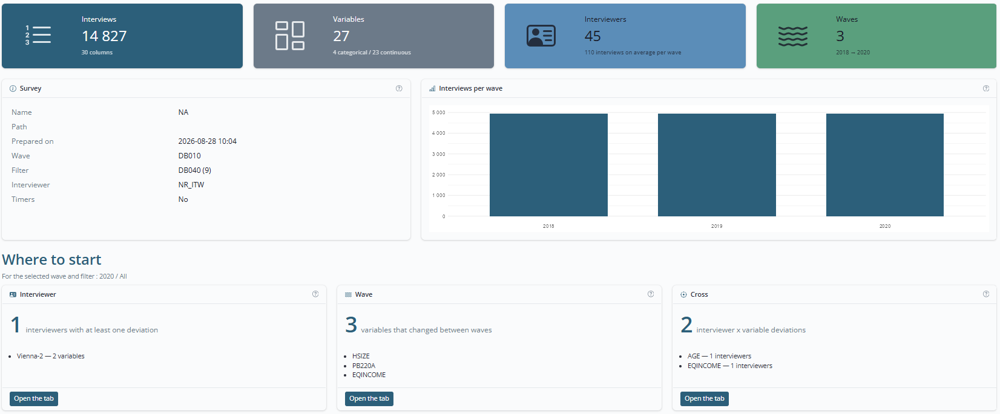
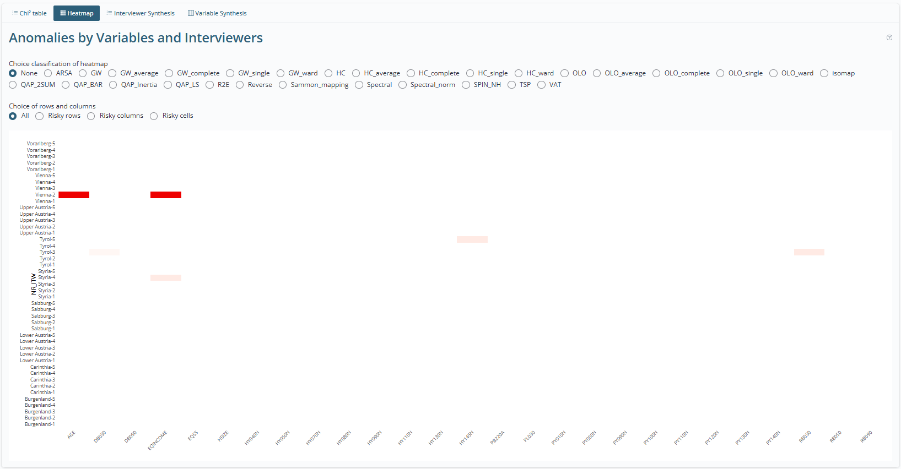
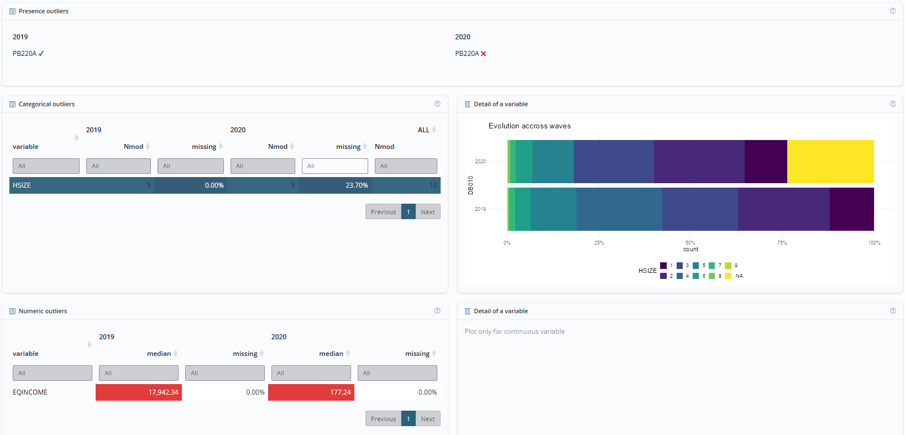

# vizsurvey

`vizsurvey` est un package R conçu pour faciliter le contrôle qualité
des données d’enquête, grâce à des diagnostics visuels réunis dans un
tableau de bord interactif. Il s’adresse particulièrement aux instituts
et aux équipes de recherche conduisant des enquêtes de grande ampleur
avec de nombreux enquêteur·rices : il offre une vue rapide et
systématique de la qualité des données, entre vagues et entre
enquêteur·rices.

`vizsurvey` ne tire aucune conclusion à votre place : il calcule des
écarts (distances de chi², scores d’anomalie, indices d’homogénéité) et
les met en évidence pour **prioriser la relecture**. L’interprétation
reste celle de l’équipe d’enquête.

## Fonctionnalités clés

- Un tableau de bord Shiny interactif : onglet de synthèse, analyse par
  enquêteur·rice, analyse par vague, croisement enquêteur·rice ×
  variable (heatmap), exploration des données, archive partagée des
  vérifications
- Le calcul automatisé des statistiques par vague et/ou par
  enquêteur·rice, avec des vagues et des filtres à un ou deux niveaux
  (par exemple année et trimestre)
- Un traitement unifié des variables : les continues sont découpées en
  classes et comparées comme les catégorielles, avec une seule distance
  de chi²
- L’analyse de l’audit trail (timers) quand il est disponible : durées
  d’entretien, travail de nuit, entretiens trop rapprochés (en refonte)
- Des outils de préparation pour gérer plusieurs enquêtes en routine
  (`config.txt`, `prepa_surveys`), avec dictionnaire de variables,
  nomenclature de libellés et archive partagée
- Une aide contextuelle sur chaque carte, une visite guidée intégrée, et
  une interface en français, anglais et néerlandais

La documentation complète et les vignettes (en français) sont
disponibles sur <https://tdelc.github.io/vizsurvey>.

## Installation

Vous pouvez installer la version de développement de `vizsurvey` depuis
GitHub :

``` r

install.packages("devtools") # si nécessaire
devtools::install_github("tdelc/vizsurvey")
```

Une publication sur le CRAN est prévue une fois la version 1.0.0
atteinte.

## Comment utiliser `vizsurvey` ?

`vizsurvey` s’utilise de deux manières complémentaires. On peut appeler
directement ses fonctions de calcul pour produire les statistiques ou
les heatmaps dans un flux reproductible (rapports automatisés, contrôles
planifiés) ; ces fonctions sont documentées dans une [vignette
dédiée](https://tdelc.github.io/vizsurvey/articles/methods.html). On
peut aussi — c’est l’usage principal — lancer le tableau de bord
interactif.

La façon la plus simple de découvrir l’interface est de partir du jeu
d’exemple intégré, dérivé de l’enquête SILC, dans lequel des erreurs
volontaires ont été injectées :

``` r

library(vizsurvey)

df <- create_eusilc_sim()

runVizsurvey_from_r(df,
                    var_intvwr = "nr_itw",
                    var_wave   = "db010",
                    var_filter = "db040")
```

L’onglet de synthèse accueille l’utilisateur·rice avec une présentation
de l’enquête et trois points d’entrée chiffrés vers les analyses. Une
visite guidée, accessible depuis la barre de navigation, parcourt
l’interface pas à pas sur les données chargées.



L’effet enquêteur·rice s’explore via une heatmap par enquêteur·rice et
par variable. Chaque case se clique pour afficher les distributions
détaillées et la comparaison entre l’enquêteur·rice et le reste de la
population.



L’effet vague est présenté sous forme de tableaux d’anomalies (variables
absentes, distributions qui bougent, médianes qui décrochent),
accompagnés de graphiques dédiés pour comprendre la nature de chaque
écart.



L’utilisation complète du tableau de bord est documentée dans une
[vignette de prise en
main](https://tdelc.github.io/vizsurvey/articles/vizsurvey.html).

Pour les organisations gérant plusieurs enquêtes en routine, une
[vignette de préparation des
données](https://tdelc.github.io/vizsurvey/articles/data-preparation.html)
décrit comment structurer les dossiers, configurer chaque enquête
(`config.txt`) et précalculer les statistiques, de sorte que l’ouverture
de l’interface soit immédiate pour toute l’équipe :

``` r

# config.txt et prepa_surveys sont supposés déjà en place ;
# voir la vignette de préparation des données
runVizsurvey_from_folder("data", depth_folder = 3)
```

## Notes de développement

Version actuelle : 0.4.3 — voir le fichier
[NEWS](https://tdelc.github.io/vizsurvey/NEWS) pour le détail des
versions.

Les noms des fonctions et des arguments sont encore susceptibles
d’évoluer sur la base des premiers retours d’usage. Notre objectif est
une stabilité complète de l’API à partir de la version **1.0.0**.

`vizsurvey` s’appuie sur deux couches de packages existants :

- une couche de calcul (préparation et analyse), fondée sur l’écosystème
  *tidyverse* et {data.table} : `cli`, `data.table`, `dplyr`, `isotree`,
  `lubridate`, `magrittr`, `purrr`, `rlang`, `scales`, `stats`,
  `tibble`, `tidyr`, `tidyselect` ;
- une couche de visualisation et de tableau de bord : `bslib`,
  `bsicons`, `DT`, `ggplot2`, `plotly`, `shiny`, `shiny.i18n`,
  `shinybusy`.

## Auteurs

**Thomas Delclite** est méthodologue statistique à Statbel, l’office
belge de statistique.

**Adrien Mierop** est data analyst à Statbel, l’office belge de
statistique.

Retours et contributions bienvenus.


