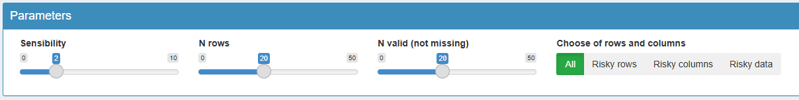
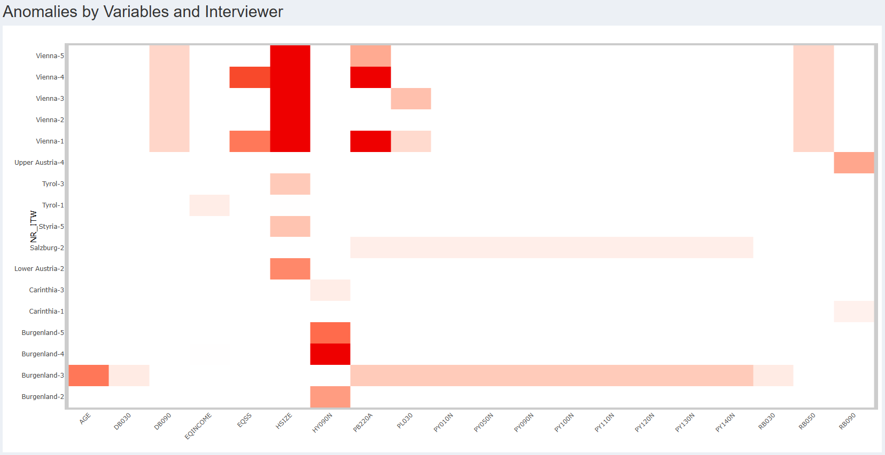
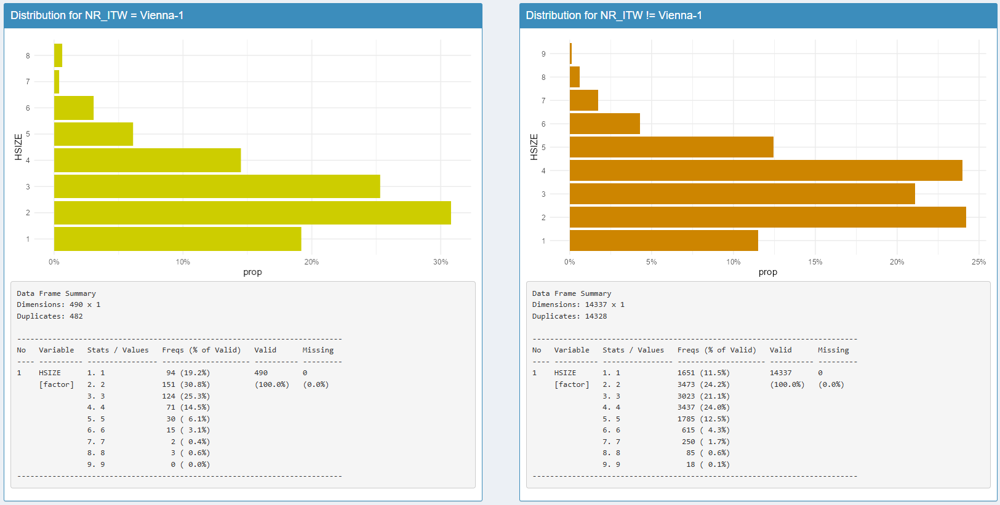
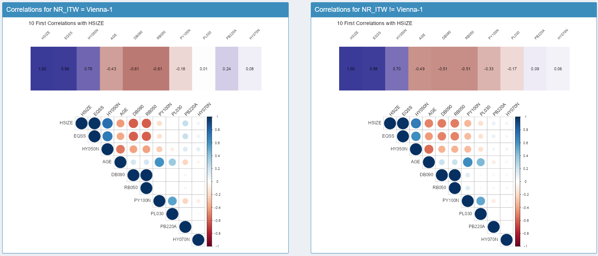
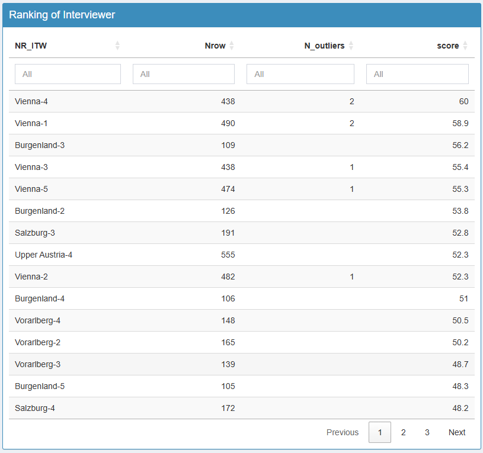
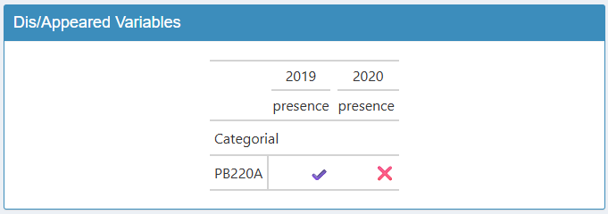
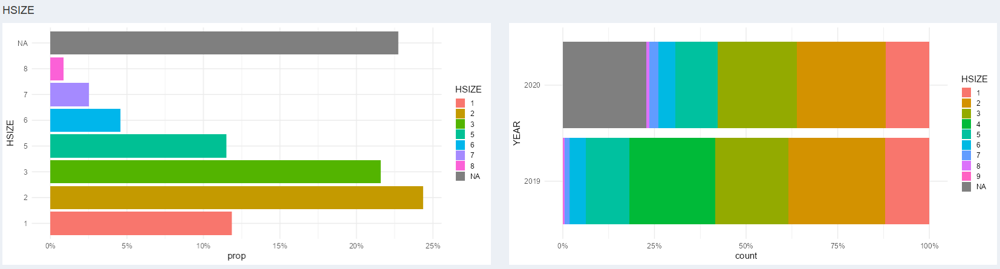
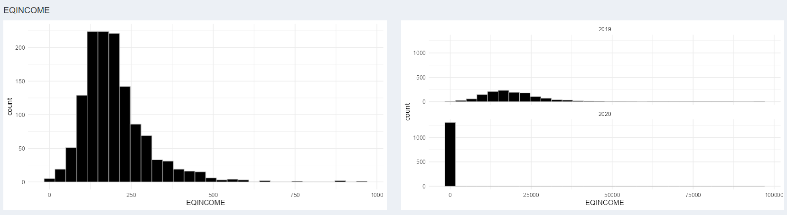

```{r, include = FALSE}
knitr::opts_chunk$set(
  collapse = TRUE,
  comment = "#>"
)
```

# Introduction

## Pourquoi vizsurvey ?

Dans un processus statistique conforme au GSBPM, la qualité ne se joue pas uniquement en amont (échantillonnage, questionnaire, collecte) ni en aval (analyse, diffusion). Entre collecte et analyse, une phase clé consiste à contrôler et monitorer le matériau collecté pour repérer rapidement les anomalies, documenter les écarts et, si nécessaire, déclencher des actions correctrices.

{vizsurvey} répond à cette problématique : il offre une interface interactive pour parcourir vos données, comparer des profils de réponses et prioriser les investigations. L'objectif n'est pas de conclure statistiquement, mais de guider le regard de l'analyste avec des indicateurs simples (distances, rangs) et des visualisations adaptées.

## Cohérence par enquêteur-rice

Le rôle des enquêteur-rices est central : compréhension fine du questionnaire, respect du routage, gestion de l'entretien. Il peut néanmoins apparaître des effets enquêteur (différences systématiques de distribution des réponses selon la personne qui interroge), dus à des styles d'administration, des biais involontaires, des erreurs récurrentes ou, plus rarement, à de la fraude.

Sur ce sujet, {vizsurvey} permet de :

-   Comparer les distributions de réponses d'un·e enquêteur·rice à tous les autres ;

-   Classer les personnes selon plusieurs indicateurs de distance ;

-   Focaliser l'examen sur les combinaisons enquêteur·rice × variable les plus atypiques.

## Cohérence par domaine

D'une année à l'autre, les questionnaires évoluent (libellés, routage, filtres), mais les variables cibles doivent rester comparables. {vizsurvey} permet de définir une variable de domaine (ici par exemple l'année de l'enquête), permettant de mettre en évidence :

-   les écarts de distributions ou de niveaux (proportions, moyennes) ;

-   les variables présentant des ruptures qui méritent une relecture (mise en œuvre du routage, recodages, version du questionnaire, changement de collecte, etc.).

## Base de données d'exemples

Nous proposons des fichiers d'enquête afin d'illustrer les fonctionnalité du package {vizsurvey} issue de deux grandes enquêtes européenne : ESS (European Social Survey) et SILC (Survey on Income and Living Conditions).

L'[ESS](https://ess.sikt.no/en/series/321b06ad-1b98-4b7d-93ad-ca8a24e8788a) est une enquête européenne menée tous les deux ans depuis 2002. Elle vise à comprendre les attitudes, les valeurs et les comportements des habitants des pays européens. Les questions portent sur des thèmes variés : la politique, la confiance dans les institutions, le bien-être, la religion, le travail, la santé, etc. L'ESS est une enquête en face à face, réalisée auprès d'un échantillon représentatif de la population adulte (à partir de 15 ans). Chaque pays participant suit un protocole commun très strict pour garantir la comparabilité internationale. Les données sont rendues publiques et servent à la recherche en sciences sociales, à la comparaison entre pays et à l'analyse des évolutions dans le temps. Nous fournissons deux vagues d'enquêtes : [ESS9](https://ess.sikt.no/en/study/bdc7c350-1029-4cb3-9d5e-53f668b8fa74/) et [ESS10](https://ess.sikt.no/en/study/172ac431-2a06-41df-9dab-c1fd8f3877e7/).

L'[EU-SILC](https://ec.europa.eu/eurostat/web/microdata/european-union-statistics-on-income-and-living-conditions) est une enquête annuelle coordonnée par Eurostat. Elle sert à mesurer les revenus, la pauvreté, les inégalités et les conditions de vie dans les pays européens. SILC permet notamment de calculer des indicateurs clés comme le taux de pauvreté le celui de privation matérielle et sociale. C'est une enquête auprès des ménages, menée par les instituts nationaux de statistique (comme Statbel en Belgique). Eurostat fournit publiquement des Public Use Files, des fichiers utilisables publiquement pour des tests. Les fichiers sont anonymisées et ne reproduisent pas nécessairement les résultats officiels. Nous fournissons deux fichiers : P-FILE (fichier des individus) et H-FILE (fichier des ménages). Il n'y a pas de numéro d'enquêteur indiqué dans ces fichiers initialement, donc un numéro fictif a été créé.

# Lancement de vizsurvey

Il y a trois manières de lancer {vizsurvey} : à partir d'une base de données en R (`runVizsurvey_from_r`), à partir d'un fichier csv (`runVizsurvey_from_file`), ou en préparant une structure de fichier pour analyser en simultané plusieurs enquêtes (`runVizsurvey_from_folder`).

## À partir d'un objet R

Pour lancer l'interface à partir d'un objet R, il suffit de d'appeler la fonction `runVizsurvey_from_r` avec le nom de l'objet.

```{r setup, eval=F, warning = F, message = F}
knitr::opts_chunk$set(warning = FALSE, message = FALSE)
library(vizsurvey)
# Not Work
runVizsurvey_from_r(df)
```

Si vous avez lancé les packages nécessaires, une interface {shiny} doit se lancer dans votre navigateur. Cette interface est pratiquement vide, car vous n'avez renseigné aucun argument, comme la variable identifiant les enquêteur·rices, celle pour identifier les domaines, et une autre pour séparer éventuellement les calculs par groupe. Voici la commande pour intégrer ces paramètres.

```{r, eval=F, warning = F, message = F}
# Not Work
runVizsurvey_from_r(df,var_itw = "NR_ITW",
                    var_domain = "ID_DOMAIN",
                    var_group = "ID_GROUP")
```

## À partir d'une base de données brute

{vizsurvey} peut aussi être utilisé à partir de fichier brut, en csv, ou tout autre format lisible par la fonction `fread` du package {data.table}. La commande est similaire à celle pour un objet R :

```{r, eval=F, warning = F, message = F}
# Not Work
runVizsurvey_from_file(path,var_itw = "NR_ITW",
                       var_domain = "ID_DOMAIN",
                       var_group = "ID_GROUP")
```

## À partir d'un répertoire de bases de données

{vizsurvey} peut gérer des multiples répertoires contenant plusieurs enquêtes.

Nous supposons, dans cette situation, que plusieurs individus utilisent {vizsurvey} à de multiples occasions, et la création des statistiques à chaque lancement de l'interface est trop longue. Il est donc nécessaire de préparer les fichiers auparavant.

Dans cette vignette, nous présentons uniquement comment visualiser les données à l'aide de {vizsurvey}. Nous détaillerons la création des fichiers dans une autre vignette.

Chaque enquête, et chaque répertoire de bases de données doit inclure un fichier global de configuration en .rds. Pour lancer l'interface, il faut renseigner le répertoire d'où proviennent les données. Voici un exemple avec les enquêtes ESS et SILC, avec les bases de données ESS9, ESS10, HFILE et PFILE.

```{r, eval=F, warning = F, message = F}
runVizsurvey_from_folder("inst/extdata")
```

# Analyse de la cohérence par enquêteur-rice

L'analyse de la cohérence par enquêteur vise à évaluer la qualité et la régularité des données collectées selon la personne ayant mené les entretiens. Dans une enquête, chaque enquêteur-rice constitue une source potentielle de variabilité non due à l'échantillonnage mais à des effets d'enquête : différences d'interprétation du questionnaire, stratégies de réponse, ou biais de saisie.

Cette étape permet donc d'identifier d'éventuelles anomalies de collecte (valeurs atypiques, proportions incohérentes, taux anormal de données manquantes), mais aussi de détecter des profils de collecte homogènes suggérant une bonne application du protocole.

L'objectif n'est pas de sanctionner, mais de documenter la fiabilité du processus de terrain, d'orienter les actions de formation et de calibrage, et d'améliorer la qualité globale des enquêtes futures.

L'analyse repose sur une comparaison systématique entre les enquêteurs pour un ensemble d'indicateurs clés (taux de non-réponse, valeurs manquantes, distributions des réponses, durées d'interview, etc.), et sur l'étude de leur dispersion statistique.

## Données d'exemples

Le package {laeken} fournit un fichier d'exemple de l'enquête SILC (Survey on Income and Living Condition). Nous pouvons prendre ce fichier comme exemple, et venir créer un faux numéro d'enquêteur-rice à partir de la variable de province `DB040`. Nous exécutons la fonction `runVizsurvey_from_r` avec comme argument supplémentaire `var_group = "DB040"` afin de prévoir des subdivisions de l'analyse par province.

```{r, eval=FALSE}
knitr::opts_chunk$set(warning = FALSE, message = FALSE)
data(eusilc) 
set.seed(123) 
eusilc$NR_ITW <- paste(eusilc$db040,sample(1:5,nrow(eusilc),replace = T),sep="-") 
runVizsurvey_from_r(eusilc,var_itw = "NR_ITW",var_group = "db040")
```

Le premier onglet de {vizsurvey} permet de naviguer de manière interactive à travers les situations détectées comme anormales concernant les enquêteur-rices.


## Analyse de la carte de chaleur

Chaque ligne est un ou une enquêtrice. Ici, nous reconnaissons les provinces australiennes avec un index, issu de notre simulation de numéro. Chaque colonne est une variable, catégorielle ou continue. Chaque cellule est colorée si les réponses de l'enquêteur-rice pour cette variable est suffisamment différentes des réponses du reste de la base de données.

Pour les variables catégorielles, il peut s'agir d'un écart trop important sur le pourcentage de données manquantes, ou d'un $\chi²$ trop élevé (donc d'une distribution très éloigné du reste de la base de données). Pour les variables numériques, il peut s'agir d'un écart trop important sur le pourcentage de données manquantes, ou d'un écart trop important sur la médiane. Dans les deux cas, ces écarts sont normalisés par variable avant affichage, et la cellule s'affiche si l'écart dépasse cinq écarts-types pour cette variable.

En survolant les cellules, toutes les informations sont affichées, de sorte à comprendre la source de la coloration. Voici une première manière d'analyser la carte de chaleur :

-   Une cellule isolée rouge n'est pas problématique en soi : avec beaucoup de croisements, il est normal d'observer quelques extrêmes.

-   Une ligne largement rouge (plusieurs variables) évoque un comportement récurrent (erreur de procédure, incompréhension, routage mal appliqué, voire fraude).

-   Une colonne rouge (plusieurs enquêteur-rices) pointe une variable fragile (libellé ambigu, routing, aide à l'enquêteur, effet d'une zone).

Par défaut, la carte de chaleur affiche une cellule en rouge lorsque les écarts dépassent 5 écarts-types de la variable. Dans notre situation, cela conduit à afficher 7 cellules, toutes pour Vienne. En réduisant le seuil de sensibilité dans les paramètres, on affiche bien plus de cellules. Il n'y a pas de seuil prédéterminée, ou statistiquement valide, pour une telle analyse. Cela doit être déterminé par tâtonnement par l'équipe en charge de la coordination de l'enquête. Il est également possible de modifier le nombre de lignes minimum (donc d'enquêtes) pour afficher la ligne, ou le nombre de valeur non manquantes nécessaires pour l'affichage d'une



Enfin, il est possible de zoomer dans la carte de chaleur, sur les lignes, les colonnes, ou les cellules à risque. Cela permet, lorsque la carte de chaleur est trop vaste, de cibler plus efficacement les situations à analyser. Voici par exemple la même carte de chaleur pour une sensibilité de deux écarts-types avec un zoom sur les cellules à risque. On voit que d'autres cellules apparaissent suite à la hausse de sensibilité, mais que certaines provinces ont disparu, car n'affichant aucune cellule rouge.



## Analyse d'une variable catégorielle

Dans notre exemple, avec une sensibilité de 5 écarts-types, sept cellules s'allument en rouge pour la région de Vienne. En cliquant sur le croisement Vienne-1 / HHSIZE, on peut afficher la distribution de cette variable HHSIZE pour l'enquêteur Vienne-1, et le comparer avec la distribution de cette variable pour les autres. Un résumé statistique de la variable est disponible en dessous à l'aide du package `summarytools`.

On découvre ainsi que les modalités 3 et 4 de la variable HHSIZE sont bien plus présentes chez les autres que chez l'enquêteur Vienne-1.



Pour essayer de comprendre les différences, nous avons inclus un algorithme qui calcule les dix corrélations les plus hautes dans la base de données, pour ensuite projeter les corrélations effectives pour l'enquêteur-rice et celle du reste de la base de données. Il s'agit uniquement de corrélations de pearson en transformant au préalable les variables catégorielles en facteur.

> **Principe directeur** : aucun test statistique n'est effectué. {vizsurvey} calcule des distances, des scores, des rangs et des corrélations destinés à **prioriser** la revue. Les conclusions analytiques restent du ressort de l'équipe méthodologique.

Pour notre enquêteur Vienne-1 et son résultat surprenant pour la variable HHSIZE, on observe que les corrélations de cette variable sont identiques chez lui et pour le reste de la base de données. Cela semble écarter l'hypothèse d'une anomalie spécifique à cette variable.



Pour revenir sur la carte de chaleur, on remarque que les cinq cellules de Vienne sont allumées en rouge pour la variable HHSIZE, preuve d'un effet de zone plutôt qu'un effet d'enquêteur-rice. Pour s'en convaincre, on peut sélectionner DB040 = Vienne en haut de l'interface. Dès lors, la carte de chaleur se limite aux données de Vienne, et n'affiche que les écarts des enquêteur-rices par rapport à cette province. Il n'y a plus aucune cellule s'affichant en rouge ainsi.


## Analyse d'une variable continue

Lorsqu'on clique sur une variable continue, la fonction de densité s'affiche alors, toujours avec le point de comparaison entre l'enquêteur-rice, et le reste de la base de données. Dans notre cas Voici un exemple pour la variable d'âge pour l'enquêtrice Carinthia-5 :


## Synthèse des anomalies

Quand le volume de croisements est important, il est difficile de savoir où commencer sur la carte de chaleur. {vizsurvey} propose un classement des enquêteur-rices avec un modèle Isolation Forest appliqué aux vecteurs de χ² pour les variables catégorielles et de médianes pour les variables continues.

La méthode Isolation Forest est une technique d'apprentissage automatique non supervisée utilisée pour établir un classement de rareté des observations. Elle repose sur une idée simple : les observations inhabituelles sont plus faciles à isoler que les observations normales. Concrètement, l'algorithme construit de nombreux arbres de décision aléatoires : à chaque nœud, une variable et une valeur de coupure sont choisies au hasard pour diviser l'échantillon. Une observation est isolée lorsqu'elle se retrouve seule dans une branche. Les observations anormales nécessitent donc moins de divisions pour être isolées. Le score d'isolation obtenu peut ensuite être utilisé pour établir un rang.

> *Important* : ce classement n'est pas une preuve. Il **priorise** l'audit (lecture ciblée des variables responsables, vérification du contexte terrain, contrôle croisé avec le suivi qualité).

Voici le classement des enquêteur-rices issue de la carte de chaleur. On retrouve enquêteur-rices de province de Vienne, mais aussi d'autres de la province de la basse et la haute Autriche. Pour ces deux derniers cas, il n'y a pas d'écarts au dessus du seuil de sensibilité, mais que l'isolation se fait rapidement.



En cliquant sur un-e enquêteur-rice, on obtient un deuxième tableau à droite avec la liste des variables. Voici l'illustration en cliquant sur l'enquêtrice Vienna-4. Cela permet d'orienter l'analyse en commençant par les variables les plus marquantes. En cliquant sur une variable, on obtient en dessous les graphiques d'analyse comme durant la carte de chaleur.


## Résumé : analyse pas à pas

1.  **Sélectionner** l'enquête et la période.
2.  **Choisir** l'onglet *Enquêteurs*.
3.  **Filtrer** la base de données selon une zone en particulier, et ajuster les paramètres d'affichage.
4.  **Parcourir la heatmap** pour repérer les zones les plus rouges.
5.  **Cliquer** sur une cellule pour ouvrir les détails (distribution, corrélation).
6.  **Comparer** à la référence et regarder la cohérence intra-variable (modalités) et inter-variables (corrélations).
7.  **Consigner** les cas récurrents (mêmes écarts sur plusieurs variables ou dans le temps).

# Analyse de la cohérence par domaine

L’analyse de la cohérence par domaine vise à vérifier la stabilité des indicateurs clés dans le temps et à détecter d’éventuelles ruptures liées à des changements de collecte, de pondération ou de comportement des répondant-es. Toutes les variables sont examinées d'un domaine à un autre (souvent d'une année sur l'autre) afin d’identifier les variations anormalement fortes qui ne s’expliqueraient pas par l’évolution réelle du phénomène observé. Cette approche permet de distinguer les fluctuations statistiques attendues (échantillonnage, conjoncture, etc.) des sauts incohérents suggérant une erreur de codage, de pondération ou de définition. L’objectif est de garantir la continuité temporelle des séries.

## Données d'exemples

Le package {laeken} fournit également un fichier d'exemple de l'enquête SES (Structural Earnings Survey). Nous pouvons prendre ce fichier comme exemple, et venir créer un faux domaine d'analyse. Nous allons créer une variable d'année à partir de la variable de province `DB040`. Nous exécutons la fonction `runVizsurvey_from_r` avec comme argument supplémentaire `var_group = "DB040"` afin de prévoir des subdivisions de l'analyse par province.

```{r, eval=F, warning = F, message = F}
data(eusilc)
set.seed(123) 
eusilc$YEAR <- sample(2010:2020,nrow(eusilc),replace=T)
eusilc[eusilc$YEAR == 2020 & eusilc$hsize == 4,"hsize"] <- NA
eusilc[eusilc$YEAR == 2020,"pb220a"] <- NA
eusilc[eusilc$YEAR == 2020,"eqIncome"] <- eusilc[eusilc$YEAR == 2020,"eqIncome"] / 100
runVizsurvey_from_r(eusilc,var_domain = "YEAR",var_group = "db040")
```

Le deuxième onglet de {vizsurvey} permet de naviguer de manière interactive à travers les situations détectées comme anormales concernant les domaines.

## Analyse des changements sur les variables

Le tableau de droite indique les variables ayant apparu ou disparu entre les domaines. On retrouve ici la variable PB220A que nous avons supprimé pour l'année 2020.



Le tableau de gauche indique les variable ayant connu un changement important. Chaque ligne est une variable ayant connu un changement entre deux modalités du domaine. Par défaut, le domaine choisi est la dernière modalité de la variable (ici 2020 pour l'année), et la comparaison se fait avec l'avant dernière modalité (ici 2019). Vous pouvez changer de modalité de référence, ou ajouter des modalités de comparaison. Attention, la lecture du tableau est peu lisible au delà de deux modalités de comparaison. Les cellules sont colorées selon le type d'écart mesuré.


Pour les variables catégorielles, il peut s'agir d'un écart trop important sur le pourcentage de données manquantes ou sur le nombre de modalités de la variable. Ici, on retrouve la variable HSIZE qui voit une hausse de données manquantes. Pour les variables continues, il peut s'agir d'un écart trop important sur le pourcentage de données manquantes ou sur la moyenne ou la médiane. Ici, on retrouve la variable EQINCOME et on regarde l'erreur de milliers.

Ce seuil de sensibilité peut être modifié, affichant plus ou moins de variables. Il est possible de faire varier du nombre de valeurs non manquantes nécessaire pour inclure la variable dans l'analyse.

## Analyse graphique

Pour chaque variable détectée dans cet onglet, des graphiques sont accessibles pour mieux comprendre les écarts entre domaine avec l'onglet *Graphics*. Pour toutes les variables, le graphique de gauche illustre la distribution de la variable pour le domaine de référence. Le graphique de droite illustre la comparaison entre les domaines sélectionnés.

Voici l'exemple pour la variable catégorielle HSIZE. On détecte automatiquement la part de données manquantes importante en 2020 et absente en 2019.



Voici l'exemple pour la variable continue EQINCOME. On détecte automatiquement la différence d'échelle des deux distributions.



## Résumé : analyse pas à pas

1.  **Sélectionner** l'enquête et la période.
2.  **Choisir** l'onglet *Domain*.
3.  **Filtrer** la base de données selon une zone en particulier, et ajuster les paramètres d'affichage.
4.  **Lister** les variables ayant apparu et disparu et vérifier si cela est justifiable.
5.  **Parcourir** les variables ayant changé, pour vérifier chaque écart en rouge.
6.  **Comparer** les variables à l'aide des graphiques.
7.  **Consigner** les cas problématiques (nouvelle modalité, distribution très différente).

# Conclusion

L'analyse de la cohérence par enquêteur-rice constitue une étape essentielle du contrôle qualité d'une enquête, mais elle ne vise pas à produire des jugements automatiques. L'outil {vizsurvey} n'infère rien : il organise l'exploration et met en évidence les régularités, écarts ou incohérences susceptibles d'attirer l'attention du service de coordination du terrain. L'interprétation des résultats doit toujours s'appuyer sur le contexte opérationnel : les consignes données aux enquêteur-rices, les conditions de collecte, les scripts utilisés, les journaux d'appels ou de connexion, ainsi que la composition des échantillons attribués. Ces éléments seuls permettent de distinguer une vraie anomalie d'un simple effet de structure ou de calendrier.

De plus, les informations mobilisées concernent parfois des données sensibles, tant sur les enquêteur-rices que sur les ménages interrogés ; elles doivent donc être traitées dans le strict respect des règles de confidentialité et de protection des données personnelles en vigueur.

En résumé, {vizsurvey} est un outil d'aide à l'analyse, pas un outil de diagnostic automatique. Il permet de rendre visibles les comportements de collecte et d'outiller la réflexion méthodologique, mais les conclusions finales relèvent toujours du jugement éclairé des équipes d'enquête.
