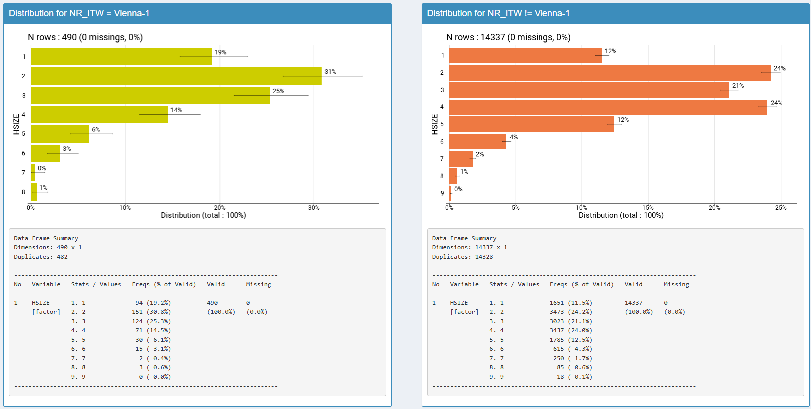
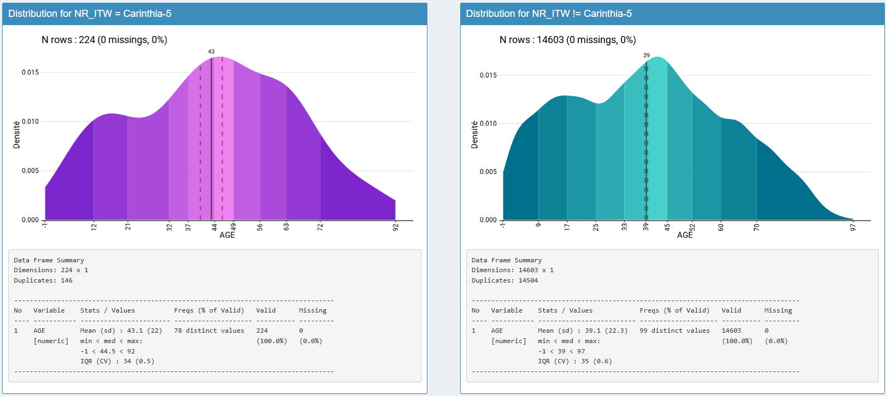

```{r, include = FALSE}
knitr::opts_chunk$set(
  collapse = TRUE,
  comment = "#>"
)
```

# Introduction

## Pourquoi vizsurvey ? (positionnement GSBPM)

Dans un processus statistique conforme au GSBPM, la qualité ne se joue pas uniquement en amont (échantillonnage, questionnaire, collecte) ni en aval (analyse, diffusion). Entre collecte et analyse, une phase clé consiste à contrôler et monitorer le matériau collecté pour repérer rapidement les anomalies, documenter les écarts et, si nécessaire, déclencher des actions correctrices.

vizsurvey répond à cette problématique : il offre une interface interactive pour parcourir vos données, comparer des profils de réponses et prioriser les investigations. L’objectif n’est pas de conclure statistiquement, mais de guider le regard de l’analyste avec des indicateurs simples (distances, rangs) et des visualisations adaptées.

## Effets **enquêteur·rice**

Le rôle des enquêteur·rices est **central** : compréhension fine du questionnaire, respect du routage, gestion de l’entretien. Il peut néanmoins apparaître des **effets enquêteur** (différences systématiques de distribution des réponses selon la personne qui interroge), dus à des styles d’administration, des biais involontaires, des erreurs récurrentes ou, plus rarement, à de la fraude.

Sur ce sujet, **vizsurvey** permet de :

-   **Comparer** les distributions de réponses d’un·e enquêteur·rice à **tous les autres** ;

-   **Classer** les personnes selon plusieurs indicateurs de distance ;

-   **Focaliser** l’examen sur les combinaisons enquêteur·rice × variable **les plus atypiques**.

## Cohérence **d’une année à l’autre**

D’une année à l’autre, les questionnaires évoluent (libellés, routage, filtres), mais les **variables cibles** doivent rester **comparables**. **vizsurvey** met en évidence :

-   les **écarts** de distributions ou de niveaux (proportions, moyennes) ;

-   les variables présentant des **ruptures** qui méritent une relecture (mise en œuvre du routage, recodages, versionnement du questionnaire, changement de collecte, etc.).

# Lancement vizsurvey

Il y a trois manières de lancer {vizsurvey} : à partir d'une base de données en R (`runVizsurvey_from_r`), à partir d'un fichier csv (`runVizsurvey_from_file`), ou en préparant une structure de fichier pour analyser en simultané plusieurs enquêtes (`runVizsurvey_from_folder`). Nous allons ici nous intéresser aux deux premiers cas.

Le package {laeken} fournit un fichier d'exemple de l'enquête SILC (survey on income and living condition). Nous pouvons prendre ce fichier comme exemple, et venir créer un numéro d'enquêteur-rice à partir de la variable de province `DB040`. Nous exécutons la fonction `runVizsurvey_from_r` avec comme argument supplémentaire `var_group = "DB040"` afin de prévoir des subdivisions du travail de terrain par province.

```{r setup, eval=F, warning = F, message = F}
knitr::opts_chunk$set(warning = FALSE, message = FALSE)
library(vizsurvey)
library(laeken)
data(eusilc)
set.seed(123)
eusilc <- eusilc %>% 
  mutate(NR_ITW = paste(db040,sample(1:5,nrow(.), replace = T),sep="-"))
runVizsurvey_from_r(eusilc,var_itw = "NR_ITW",var_group = "db040")
```

Si vous avez lancé les packages nécessaires, une interface shiny doit se lancer dans votre navigateur, et afficher cette carte de chaleur. Celle-ci est le coeur du fonctionnement de vizsurvey, car elle permet de naviguer de manière interactive à travers les situations détectées comme anormales.


Chaque ligne est un ou une enquêtrice. Ici, nous reconnaissons les provinces australiennes avec un index, issu de notre simulation de numéro. Chaque colonne est une variable, catégorielle ou continue. Chaque cellule est colorée si les réponses de l'enquêteur-rice pour cette variable est suffisamment différentes des réponses du reste de la base de données.

-   Pour les variables catégorielles, il peut s'agir d'un écart trop important sur le pourcentage de données manquantes, ou d'un $$\chi²$$ trop élevé (donc d'une distribution très éloigné du reste de la base de données) ;

-   Pour les variables numériques, il peut s'agir d'un écart trop important sur le pourcentage de données manquantes, ou d'une écart trop important sur la médiane.

Eu survolant les cellules, toutes les informations sont affichées, de sorte à comprendre la source de la coloration. Voici une première manière d'analyser la carte de chaleur :

-   Une **cellule isolée** “chaude” n’est pas problématique en soi — avec beaucoup de croisements, il est **normal** d’observer quelques extrêmes.

-   Une **ligne** largement “chaude” (plusieurs variables) évoque un **comportement récurrent** (erreur de procédure, incompréhension, routage mal appliqué, voire fraude).

-   Une **colonne** “chaude” (plusieurs enquêteur-rices) pointe une **variable fragile** (libellé ambigu, routing, aide à l’enquêteur, effet d'une zone).

Dans notre exemple, plusieurs cellules s'allument en rouge pour la région de Vienne. En cliquant sur le croisement Vienne-1 / HHSIZE, on peut afficher la distribution de cette variable HHSIZE pour l'enquêteur Vienne-1, et le comparer avec la distribution de cette variable pour les autres. On découvre ainsi que le pourcentage de modalités 3 et 4 sont bien plus présent chez les autres que chez l'enquêteur Vienne-1.



Ici, on remarque que les 5 lignes de Vienne sont allumées en rouge, preuve d'un effet de zone plutôt qu'un effet d'enquêteur·rice. Pour s'en convaincre, on peut sélectionner DB040 = Vienne en haut de l'interface. Dès lors, la carte de chaleur se limite aux données de Vienne, et n'affiche que les écarts des enquêteur-rices par rapport à cette province. Il n'y a plus aucune cellule s'affichant en rouge ainsi.


Lorsqu'on clique sur une variable numérique, la fonction de densité s'affiche alors, toujours avec le point de comparaison. Voici un exemple pour la variable d'âge pour l'enquêtrice Carinthia-5 :



### Pas à pas — volet enquêteurs

1.  **Sélectionner** l’enquête et la période (ex. semaine N, vague t).

2.  **Choisir** l’onglet *Enquêteurs* puis une **famille de variables** (catégorielles / continues).

3.  **Parcourir la heatmap** enquêteur·rice × variable (voir §5) pour repérer les cellules les plus “chaudes”.

4.  **Cliquer** sur une cellule pour ouvrir les **détails** (barplots, tables de fréquences, filtres).

5.  **Comparer** l’enquêteur·rice à la **référence** (tous les autres) et regarder la cohérence **intra-variable** (modalités) et **inter-variables** (corrélations).

6.  **Consigner** les cas récurrents (mêmes écarts sur plusieurs variables ou dans le temps).

```{r, eval=F, warning = F, message = F}
knitr::opts_chunk$set(warning = FALSE, message = FALSE)
data(eusilc)
set.seed(123)
eusilc <- 2024:2025 %>% purrr::map_df(~{
  eusilc %>% mutate(db010 = .x)
})

eusilc <- eusilc %>%
  mutate(eqSS = eqSS - 2*as.numeric(db010 == 2025),
         pb220a = ifelse(db010 == 2025 & pb220a == "AT",NA,pb220a))

runVizsurvey_from_r(eusilc,var_itw = "NR_ITW",
                    var_domain = "db010", var_group = "db040")
```

# Indicateurs calculés (sans test statistique)

> **Principe directeur** : aucun **test** n’est effectué. **vizsurvey** calcule des **distances**, des **scores** et des **rangs** destinés à **prioriser** la revue. Les conclusions analytiques restent du ressort de l’équipe méthodologique.

## Distance de type **χ²** pour variables catégorielles (effets enquêteur·rice)

Pour chaque variable catégorielle et chaque enquêteur-rice, on compare la distribution observée chez lui ou elle à celle de la **référence** (tous-tes les enquêteur·rices). On calcule un **χ² de distance** (de type Pearson) :

-   Un **χ² élevé** signale un **profil atypique** sur cet-te enquêteur-rice.

-   Les valeurs sont **affichées** par enquêteur-rice et variable ;

> *Bonnes pratiques* : filtrer les **petits effectifs**, fixer un **seuil minimal** d’observations, travailler sur des variables **propres** (NA explicites, modalités cohérentes).

## Différences **inter-annuelles** (standardisation simple)

Pour comparer deux domaines (souvent des années), **vizsurvey** calcule, selon le type de variable :

-   **Catégorielles** : différence du pourcentage de données manquantes ; différence relative du nombre de modalités ;

-   **Continues** : différence du pourcentage de données manquantes ; différence relative de la moyenne et de la médiane ;

Dès qu'un score est supérieur à un seuil, la variable est affichée, et sa distribution de l'année en cours et des différentes années testées sont affichées. Ils **n’impliquent pas** de décision statistique (pas de p-valeur), mais **orientent** la revue.

## Classer pour prioriser : **Isolation Forest** sur profils de distances

Quand le volume de croisements est important, il est difficile de savoir **où commencer**. **vizsurvey** propose un classement **enquêteur·rices** via un modèle **Isolation Forest** appliqué aux **vecteurs de χ²** (une composante par variable catégorielle).

-   **Idée** : un profil “atypique” est **plus facile à isoler** dans l’espace des distances.

-   **Entrées** : pour chaque enquêteur·rice, un vecteur (χ2(V1),χ2(V2),…)(\chi\^2(V_1), \chi\^2(V_2), \ldots)(χ2(V1​),χ2(V2​),…), éventuellement **standardisé** et **tronqué** (winsorisation) pour limiter l’influence des très grands χ² dus à de minuscules effectifs.

-   **Sortie** : un **score d’anomalie** (continu) permettant de **trier** les personnes à examiner **en premier**.

> *Important* : ce classement **n’est pas une preuve**. Il **priorise** l’audit (lecture ciblée des variables responsables, vérification du contexte terrain, contrôle croisé avec le suivi qualité).

# Limites et responsabilités

-   **vizsurvey** **n’infère** rien : il **organise** l’exploration.

-   Les **interprétations** doivent s’appuyer sur le **contexte** (terrain, consignes, scripts, logs).

-   Les **données sensibles** (enquêteur·rices, ménages) doivent être traitées conformément aux règles de **confidentialité**.

## Introduction

Ce tutoriel présente un enchaînement complet allant de la préparation de vos données jusqu'à l'exploration de l'application Shiny fournie par **vizsurvey** pour analyser les effets enquêteur. Il s'adresse à des utilisateurs disposant d'un corpus d'entretiens enquêtés et d'un fichier de configuration décrivant les variables clés.

Au fil des sections, vous apprendrez à :

-   préparer l'arborescence de données avec `prepa_survey()` ;
-   lancer le tableau de bord `runVizsurvey_*()` ;
-   tirer parti des fonctions utilitaires comme `prepa_stats()` ou `score_isoforest()` ;
-   résoudre les problèmes courants rencontrés lors de l'importation.

Nous utiliserons des exemples reproductibles que vous pourrez adapter à votre propre projet.

## Installation

```{r eval=FALSE}
# Depuis CRAN (lorsque disponible)
install.packages("vizsurvey")

# Ou depuis GitHub pour la version de développement
if (!requireNamespace("remotes", quietly = TRUE)) {
  install.packages("remotes")
}
remotes::install_github("tdelc/vizsurvey")
```

**Packages suggérés** :

-   `shiny` et `shinydashboard` pour l'interface ;
-   `isotree` pour le score d'isolement ;
-   `cli` et `progressr` pour le suivi des traitements ;
-   `readr`, `dplyr`, `tidyr` pour la manipulation des données.

Assurez-vous que ces dépendances sont disponibles, surtout si vous utilisez les fonctionnalités avancées.

## Préparer vos données

### 1. Structurer les fichiers d'entrée

L'outil `prepa_survey()` attend une arborescence de type :

```         
data/
├── ENQ_1/
│   ├── enquête1_1.csv
│   └── enquête1_2.csv
└── ENQ_2/
    ├── enquête1_1.csv
    └── enquête1_2.csv
```

Chaque CSV représente les réponses individuelles d'une enquête, tandis que le fichier YAML correspondant décrit les variables (identifiants, domaines, modalités, etc.).

Voici un exemple minimal de configuration (fichier `config_enquête1.yml`) :

``` yaml
id_itw: id_interview
vt: type_ménage
vg: region
interviewer: id_enqueteur
weight: poids
variables:
  - name: satisfaction
    type: numeric
    label: "Score de satisfaction"
  - name: mode
    type: categorical
    label: "Mode de collecte"
```

### 2. Créer une configuration à partir d'un gabarit

Vous pouvez générer un gabarit initial avec `create_config()` :

```{r eval=FALSE}
library(vizsurvey)

template <- create_config(
  interviewer = "id_enqueteur",
  id_itw      = "id_interview",
  vt          = "type_ménage",
  vg          = "region",
  weight      = "poids"
)

# Écrire le gabarit dans un fichier YAML
config_path <- tempfile(fileext = ".yml")
writeLines(template, config_path)
cat(readLines(config_path), sep = "\n")
```

Adaptez ensuite les sections `variables` pour décrire les indicateurs que vous souhaitez analyser (numériques, catégoriels ou binaires).

### 3. Lancer la préparation

```{r eval=FALSE}
library(vizsurvey)

input_dir  <- "mon-projet"
output_dir <- file.path(tempdir(), "prepa")

prepa_survey(
  input_dir  = input_dir,
  output_dir = output_dir,
  config     = "configs/config_enquête1.yml",
  survey     = "data/enquête1.csv"
)
```

Cette commande :

1.  lit le CSV de réponses ;
2.  applique les définitions du YAML (typage, filtres éventuels) ;
3.  calcule des statistiques agrégées et les sauvegarde en `.rds` ;
4.  journalise l'avancement dans la console via `cli`.

Les fichiers générés (`*_stats.rds`, `*_meta.rds`) serviront directement à alimenter l'application Shiny.

## Lancer le tableau de bord

### Utiliser des données préparées

Lorsque les `.rds` ont été produits, lancez l'application via :

```{r eval=FALSE}
runVizsurvey_from_folder(output_dir)
```

L'interface Shiny s'ouvre dans votre navigateur et charge automatiquement les statistiques disponibles dans le dossier.

### Importer un fichier CSV à la volée

Pour explorer rapidement un fichier sans passer par `prepa_survey()`, utilisez `runVizsurvey_from_file()` :

```{r eval=FALSE}
runVizsurvey_from_file(
  file   = "mon-projet/data/enquête1.csv",
  config = "mon-projet/configs/config_enquête1.yml"
)
```

L'application prépare alors temporairement les données (dans un répertoire `tempdir()`) et les affiche immédiatement.

### Depuis un objet R déjà chargé

Si vos données résident déjà en mémoire sous forme de data.frame, combinez-les avec `runVizsurvey_from_r()` :

```{r eval=FALSE}
library(readr)
library(vizsurvey)

df <- read_csv("mon-projet/data/enquête1.csv")
runVizsurvey_from_r(
  data   = df,
  config = "mon-projet/configs/config_enquête1.yml"
)
```

## Explorer l'interface

L'application se compose de plusieurs onglets :

1.  **Vue d'ensemble** : effectifs globaux, taux de réponse par enquêteur, filtres interactifs.
2.  **Classement enquêteurs** : statistiques détaillées (moyennes, variances, écarts aux médianes) afin d'identifier les profils atypiques.
3.  **Cartes de chaleur** : visualisation de `heat_map_group()` pour repérer les variables problématiques par domaine ou sous-groupe.
4.  **Analyse statistique** : résultats des tests de khi-deux et d'ANOVA selon la nature des variables.

Conseils d'interprétation :

-   Utilisez les filtres (domaine, mode, période) pour isoler des segments précis.
-   Comparez les contributions au khi-deux pour déterminer quelles modalités alimentent les écarts.
-   Exportez les tableaux via les boutons intégrés lorsque vous souhaitez partager une photographie de la situation.

## Allers-retours analytiques

### `prepa_stats()` : extraire les agrégats

`prepa_stats()` vous renvoie un data.frame compilant les statistiques calculées pendant la préparation. Vous pouvez l'utiliser pour alimenter des rapports ou construire vos propres visualisations.

```{r eval=FALSE}
stats <- prepa_stats(output_dir)
head(stats)
```

### `heat_map_group()` : personnaliser la visualisation

Pour générer une heatmap hors Shiny :

```{r eval=FALSE}
library(dplyr)

data_group <- stats %>%
  dplyr::filter(variable == "satisfaction")

heat_map_group(
  data_group,
  group_var   = "vg",
  interviewer = "interviewer",
  value       = "mean",
  show_legend = TRUE
)
```

Vous pouvez ajuster la palette via l'argument `palette` et contrôler les titres à l'aide de `title` et `subtitle`.

### `score_isoforest()` : détecter les profils atypiques

```{r eval=FALSE}
library(dplyr)

donnees_num <- df %>% dplyr::select(where(is.numeric))
iso_scores  <- score_isoforest(donnees_num)

head(iso_scores)
```

Avant de lancer cette fonction, assurez-vous que les colonnes sélectionnées sont numériques, sans valeurs manquantes excessives. Standardisez ou filtrez les variables constantes pour éviter des avertissements.

## Traitements par lot

Si vous avez plusieurs enquêtes à traiter dans un répertoire, `prepa_all_surveys()` automatisera la boucle :

```{r eval=FALSE}
prepa_all_surveys(
  input_dir  = "mon-projet",
  output_dir = output_dir,
  pattern    = "*.csv"
)
```

Chaque jeu de données sera préparé avec le fichier YAML du même nom (à l'extension près). Surveillez la console pour connaître l'avancement et les éventuels problèmes rencontrés sur un fichier spécifique.

## Résolution de problèmes

| Symptôme | Cause probable | Solution |
|----|----|----|
| `argument is of length zero` | Clé absente dans le YAML (`vt`, `vg`, etc.) | Vérifiez la présence des clés et leur orthographe. |
| `object 'write_csv' not found` | `readr` non attaché lors de `create_fake_silc()` | Chargez `readr` ou utilisez `readr::write_csv`. |
| `non-numeric argument to binary operator` | Colonnes non numériques lors d'un calcul | Filtrez avec `dplyr::select(where(is.numeric))` avant traitement. |
| Heatmap vide | Aucun enregistrement dans la combinaison domaine/groupe | Contrôlez les filtres ou élargissez la période analysée. |

Activez les options de diagnostic supplémentaires avec :

```{r eval=FALSE}
options(vizsurvey.verbose = TRUE)
```

Cette option affiche des messages détaillés pendant la préparation pour identifier rapidement les enregistrements problématiques.

## Exemple reproductible complet

Le bloc ci-dessous illustre un flux complet à partir d'un jeu de données synthétique :

```{r eval=FALSE}
library(vizsurvey)
library(readr)
library(dplyr)
library(tidyr)

# 1. Générer un exemple fictif
tmp_dir <- tempdir()
set.seed(123)

df <- tibble::tibble(
  id_interview = 1:200,
  id_enqueteur = sample(sprintf("E%02d", 1:12), 200, replace = TRUE),
  type_ménage  = sample(c("Solo", "Couple", "Famille"), 200, replace = TRUE),
  region       = sample(c("Nord", "Sud", "Est", "Ouest"), 200, replace = TRUE),
  poids        = runif(200, 0.5, 1.5),
  satisfaction = rnorm(200, mean = 6, sd = 1.2),
  mode         = sample(c("Téléphone", "Face-à-face", "Web"), 200, replace = TRUE)
)

# 2. Sauvegarder les fichiers d'entrée
input_dir <- file.path(tmp_dir, "demo")
dir.create(file.path(input_dir, "data"), recursive = TRUE)
dir.create(file.path(input_dir, "configs"), recursive = TRUE)

readr::write_csv(df, file.path(input_dir, "data", "demo.csv"))

config_yaml <- "id_itw: id_interview\ninterviewer: id_enqueteur\nvt: type_ménage\nvg: region\nweight: poids\nvariables:\n  - name: satisfaction\n    type: numeric\n    label: Score de satisfaction\n  - name: mode\n    type: categorical\n    label: Mode de collecte\n"

writeLines(config_yaml, file.path(input_dir, "configs", "demo.yml"))

# 3. Préparer les données
output_dir <- file.path(tmp_dir, "demo_prepa")
prepa_survey(
  input_dir  = input_dir,
  output_dir = output_dir,
  config     = "configs/demo.yml",
  survey     = "data/demo.csv"
)

# 4. Lancer l'application (ouvre un onglet navigateur)
runVizsurvey_from_folder(output_dir)
```

Cet exemple crée un environnement isolé dans le dossier temporaire de R, traite les données synthétiques et lance l'application. Adaptez les noms de variables aux vôtres pour reproduire le processus sur vos enquêtes réelles.

## Ressources complémentaires

-   Documentation de référence : `?prepa_survey`, `?runVizsurvey_from_folder`, `?prepa_stats` ;
-   Issues et contributions : <https://github.com/InseeFrLab/vizsurvey/issues> ;
-   Lectures méthodologiques : Groves & al. (2009) *Survey Methodology*, Lynn (2021) *Advances in Longitudinal Survey Methodology*.

Bonne exploration avec **vizsurvey** !
