```{r, include = FALSE}
knitr::opts_chunk$set(
  collapse = TRUE,
  comment = "#>"
)
```

# Introduction

## Why vizsurvey?

In a statistical process aligned with the GSBPM, quality is not decided only upstream (sampling, questionnaire, data collection) or downstream (analysis, dissemination). Between collection and analysis lies a key phase: checking and monitoring the material collected, in order to spot anomalies quickly, document discrepancies and, where necessary, trigger corrective action.

{vizsurvey} addresses this need: it offers an interactive interface to browse your data, compare response profiles and prioritise investigations. The goal is not to draw statistical conclusions, but to guide the analyst's eye with simple indicators (distances, ranks) and suitable visualisations.

## Interviewer consistency

The interviewer's role is central: a fine-grained understanding of the questionnaire, adherence to the routing, and management of the interview. Interviewer effects may nonetheless appear (systematic differences in the response distribution depending on who conducts the interview), stemming from different working methods, unintentional biases, recurring errors or, more rarely, fraud.

On this topic, {vizsurvey} lets you:

-   Compare one interviewer's response distributions against all the others;
-   Rank interviewers according to several distance indicators;
-   Focus the review on the most atypical interviewer × variable combinations.

## Survey wave consistency

From one year to the next, questionnaires evolve (labels, routing, filters), but the target variables should remain comparable. {vizsurvey} lets you define a wave variable (here, for example, the survey year), which highlights:

-   gaps in distributions or levels (proportions, means);
-   variables showing breaks that warrant a second look (routing implementation, recoding, questionnaire version, change in data collection, etc.).

# Launching vizsurvey

There are two main ways to launch {vizsurvey}: from a database held in R (`runVizsurvey_from_r`), or by preparing a file structure to analyse several surveys at once (`runVizsurvey_from_folder`).

## From an R object

To launch the interface from an R object, simply call `runVizsurvey_from_r` with the name of the object.

```{r setup, eval=F, warning = F, message = F}
knitr::opts_chunk$set(warning = FALSE, message = FALSE)
library(vizsurvey)
# Not Run
runVizsurvey_from_r(df)
```

Once the required packages are loaded, a {shiny} interface opens in your browser. At this stage the interface is almost empty, because you have not supplied any arguments yet, such as a variable identifying the interviewers, a variable identifying the survey waves, or a variable used as a filter. Here is the command for passing those parameters.

```{r, eval=F, warning = F, message = F}
# Not Run
runVizsurvey_from_r(df,
                    var_intvwr = "NR_ITW",
                    var_wave   = "YEAR",
                    var_filter = "REGIO")
```

Here, `var_intvwr` identifies the interviewers, `var_wave` identifies the survey waves, and `var_filter` is an optional variable used to **filter** the analysis (for example, restricting it to a particular region). When a filter variable is supplied, the analyses are produced both at the global level and within each value of the filter.

### Optional: an interviewer summary file

In addition to the microdata, you can supply an **optional summary file containing one row per interviewer**. This file gathers interviewer-level indicators that are not derived from the response distributions themselves, for example the number of completed interviews, the average interview duration, the response or contact rate, the share of refusals, and so on. It must include the interviewer identifier (the same one used in `var_intvwr`) so that it can be matched to the microdata.

When such a file is provided, {vizsurvey} automatically integrates and analyses it alongside the response distributions. Any atypical interviewer-level indicator (for example an unusually short average interview duration, an extreme response rate, or an unusual number of completed interviews) is then flagged as a potential anomaly, in the same way as the distributional discrepancies.

```{r, eval=F, warning = F, message = F}
# Not Run
runVizsurvey_from_r(df,
                    var_intvwr     = "NR_ITW",
                    var_wave       = "YEAR",
                    var_filter     = "REGIO",
                    data_synthesis = interviewer_summary)
```

## From a directory of databases

The {vizsurvey} package can handle several directories containing different surveys. In this kind of setup, the assumption is that several users run {vizsurvey} at different times. Because generating the statistics every time the application starts can be too slow, it is preferable to prepare the files in advance, so that opening the interface is more responsive.

Each survey (and therefore each database folder) must contain a global configuration file in `.rds` format. The optional interviewer summary file described above can also be included in this prepared structure, and will be integrated automatically in the same way. To launch the interface, you then only need to point to the source directory of the data and indicate the number of nested sub-directories (1 if the directory contains a single survey, 2 if several folders are present, 3 if several folders themselves contain several survey folders). The [data preparation vignette](https://tdelc.github.io/vizsurvey/articles/data-preparation.html) explains all of this in detail. Here, for example, is the command for a structure with 2 directory levels and 1 file level.

```{r, eval=F, warning = F, message = F}
runVizsurvey_from_folder("data", depth_folder = 3)
```

# Interviewer consistency analysis

The interviewer consistency analysis helps identify possible collection anomalies by systematically comparing one interviewer with the full population across a set of key indicators (missing or atypical values, response distributions).

This makes it possible to assess the quality and regularity of the data collected by the person who conducted the interviews. In a survey, each interviewer is a potential source of variability that is not due to sampling but to survey effects: differences in how the questionnaire is interpreted, response strategies, or data-entry bias. It also makes it possible to spot homogeneous collection profiles that suggest the protocol was applied correctly.

These comparisons can be examined through a filter, often to restrict the analysis to a subpopulation in which respondent profiles are similar (for example a given geographic area). When a filter variable is supplied, the interviewer consistency analysis is carried out both at the global level and within each value of the filter.

## Example data

The {laeken} package provides an example file from the SILC survey. We can use this file as an example and create a fake interviewer number from the province variable `DB040`. We run `runVizsurvey_from_r` with the additional argument `var_filter = "DB040"` so as to enable the per-province (filtered) analysis.

```{r, eval=FALSE}
knitr::opts_chunk$set(warning = FALSE, message = FALSE)
data(eusilc)
set.seed(123)
eusilc$NR_ITW <- paste(eusilc$db040, sample(1:5, nrow(eusilc), replace = T), sep = "-")
runVizsurvey_from_r(eusilc, var_intvwr = "NR_ITW", var_filter = "db040")
```

The first tab of {vizsurvey} lets you navigate interactively through the situations detected as atypical for the interviewers.

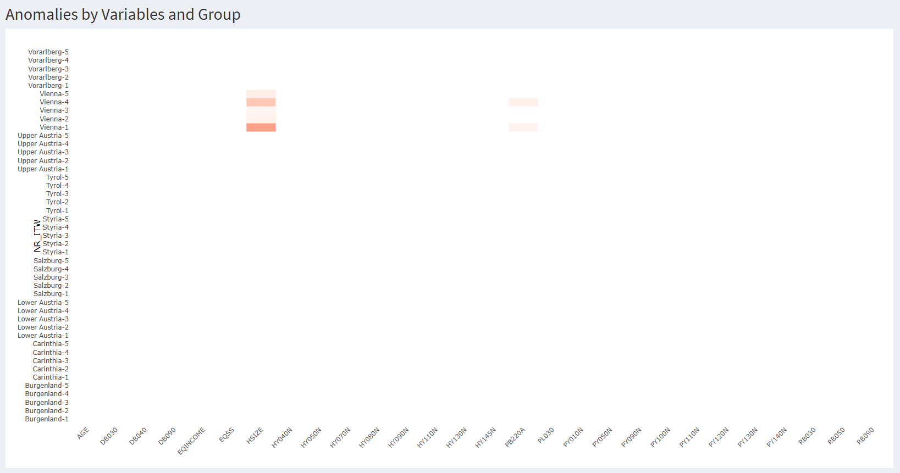

## Reading the heatmap

Each row is an interviewer. Here we recognise the Austrian provinces with an index, coming from the interviewer number we created. Each column is a variable, categorical or continuous. Each cell is coloured if an interviewer's responses for that variable are sufficiently different from the responses in the rest of the database.

For categorical variables, this may be too large a gap in the share of missing values, or a $\chi^2$ that is too high (i.e. a distribution very far from the rest of the database). For numeric variables, it may be too large a gap in the share of missing values or in the median. In both cases, these gaps are normalised per variable before display, and the cell is shown if the gap exceeds five standard deviations for that variable. The methodological detail of the calculations is given in a dedicated vignette.

Hovering over a cell displays all the underlying information, so you can understand the source of the colouring. Here is a first way to read the heatmap:

-   An isolated red cell is not in itself a problem: with many crossings, it is normal to observe a few extreme values.

-   A row that is regularly red (across several variables) suggests recurring behaviour (procedural error, misunderstanding, poorly applied routing, or even fraud).

-   A red column (across several interviewers) points to a fragile variable (ambiguous label, routing, or the effect of a filter / subpopulation).

By default, the heatmap colours a cell red when one of the gaps exceeds 5 standard deviations for the variable. In our case, this displays 7 cells, all for Vienna. Lowering the sensitivity threshold in the settings displays many more cells. There is no predetermined or statistically valid threshold for this kind of analysis. It has to be set by trial and error by the team in charge of survey coordination. You can also change the minimum number of rows (i.e. interviews) required to display a row, or the number of non-missing values required to display a cell.

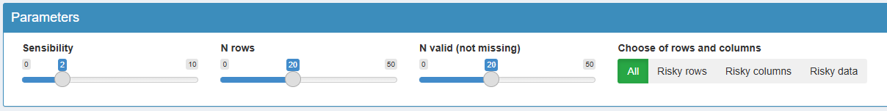Finally, you can zoom into the heatmap, on rows, columns, or the at-risk cells. When the heatmap is too large, this helps target the situations worth analysing more efficiently. Here, for example, is the same heatmap at a sensitivity of two standard deviations, zoomed in on the at-risk cells. We see that other cells appear as sensitivity increases, but that some interviewers have disappeared, because they no longer display any red cell.

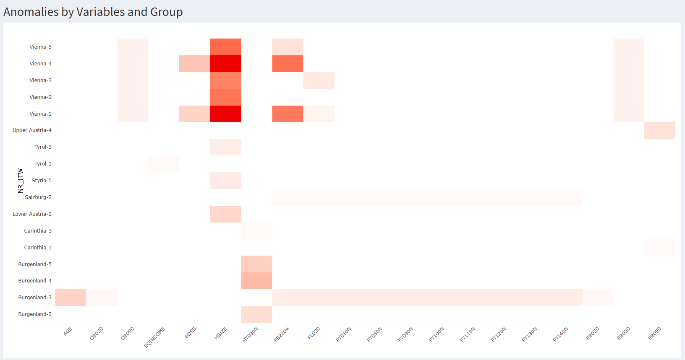

## Analysing a categorical variable

In our example, at a sensitivity of 5 standard deviations, seven cells light up red for the Vienna region. By clicking on the Vienna-1 / HHSIZE crossing, you can display the distribution of HHSIZE for interviewer Vienna-1 and compare it with the distribution of that variable for the others. A statistical summary of the variable is available below, using the `summarytools` package.

We thus discover that categories 3 and 4 of HHSIZE are much less frequent for interviewer Vienna-1 than for the others.

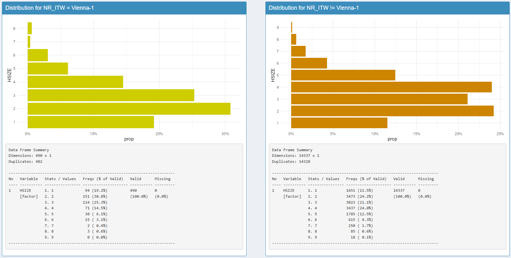 To help understand these differences, we have included an algorithm that computes the ten highest correlations in the database, and then projects the actual correlations for the interviewer against those of the rest of the database. These are simply Pearson correlations, after first converting the categorical variables to factors.

> **Guiding principle**: no statistical test is performed. {vizsurvey} computes distances, scores, ranks and correlations meant to **prioritise** the review. Analytical conclusions remain the responsibility of the methodology team.

For interviewer Vienna-1 and the surprising result for HHSIZE, we observe that the correlations of that variable are identical for this interviewer and for the rest of the database. This seems to rule out the hypothesis of an anomaly specific to that variable.

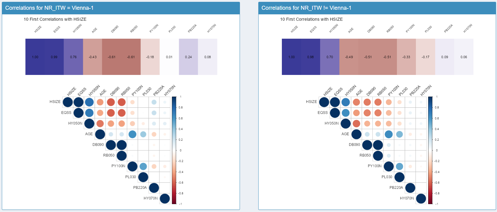

Returning to the heatmap, we notice that the five Vienna cells are red for HHSIZE, evidence of a filter (subpopulation) effect rather than an interviewer effect. To confirm this, you can select DB040 = Vienna at the top of the interface. The heatmap is then restricted to the Vienna data and only displays the interviewers' gaps relative to that province. As a result, no cell appears red any more.

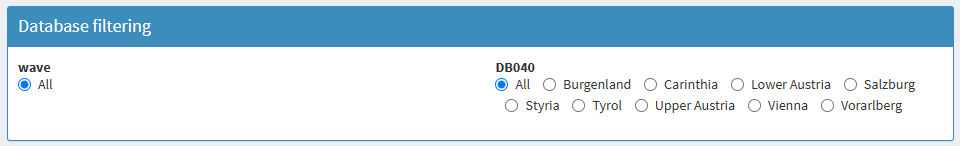

## Analysing a continuous variable

When you click on a continuous variable, the density function is displayed, again with the comparison between the interviewer and the rest of the database. In our case, here is an example for the age variable for interviewer Carinthia-5:

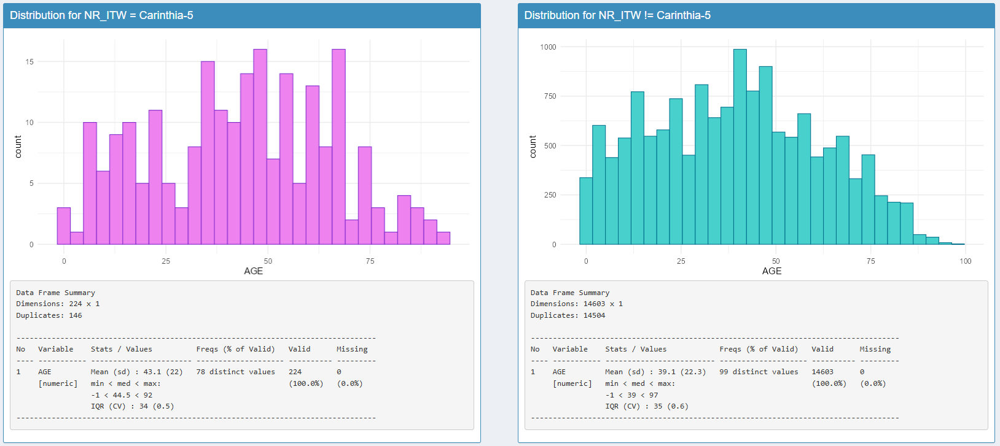

## Anomaly summary

When the number of crossings is large, it is hard to know where to start on the heatmap. {vizsurvey} offers a ranking of interviewers using an Isolation Forest model applied to the vectors of $\chi^2$ values for categorical variables and of medians for continuous variables. When an interviewer summary file is supplied, its indicators are added to these vectors, so that interviewer-level anomalies are taken into account in the same ranking.

The [Isolation Forest](https://cran.r-project.org/web/packages/isotree/vignettes/An_Introduction_to_Isolation_Forests.html) method is an unsupervised machine-learning technique used to rank observations by rarity. It rests on a simple idea: unusual observations are easier to isolate than "normal" ones. Concretely, the algorithm builds many random decision trees: at each node, a variable and a split value are chosen at random to split the sample. An observation is isolated when it ends up alone in a branch. Abnormal observations therefore require fewer splits to be isolated. The resulting isolation score can then be used to produce a rank.

> *Important*: this ranking is not proof. It **prioritises** the audit (targeted reading of the variables responsible, checking the field context).

Here is the ranking of interviewers derived from the heatmap. We find interviewers from the province of Vienna, but also others from Lower and Upper Austria. For these last two, no gap exceeds the sensitivity threshold, but isolation happens quickly.

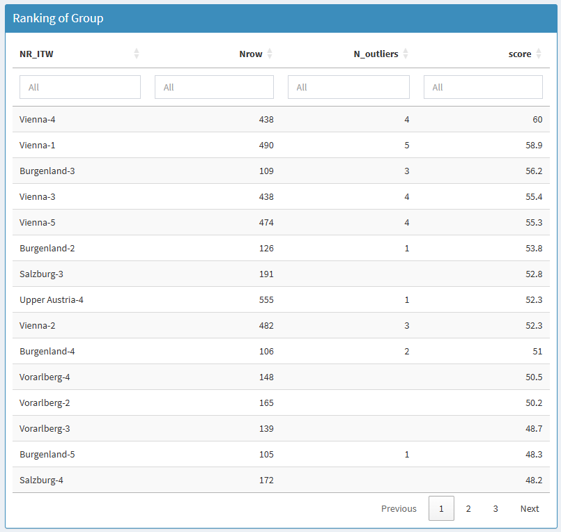

Clicking on an interviewer produces a second table on the right, with the list of variables. Here is the illustration for interviewer Vienna-4. This helps direct the analysis by starting with the most striking variables. Clicking on a variable then displays, below, the analysis charts, just as with the heatmap.

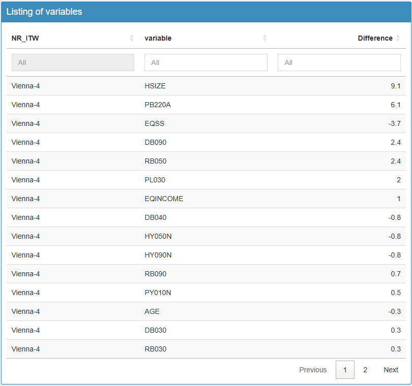

## Summary: step-by-step analysis

1.  **Select** the survey.
2.  **Choose** the *Interviewers* tab.
3.  **Filter** the database on a particular wave and filter value, and adjust the display settings.
4.  **Scan the heatmap** to spot the reddest areas.
5.  **Click** on a cell to open the details (distribution, correlation).
6.  **Compare** with the reference and look at within-variable consistency (categories) and between-variable consistency (correlations).
7.  **Record** recurring cases (the same gaps across several variables or over time).

# Survey wave consistency analysis

The survey wave consistency analysis aims to check the stability of the key indicators over time and to detect possible breaks linked to changes in data collection, weighting or respondent behaviour. All variables are examined from one wave to the next (often year on year) in order to identify abnormally large variations that would not be explained by the real evolution of the observed phenomenon. This approach distinguishes the expected statistical fluctuations (sampling, economic conditions, etc.) from inconsistent jumps suggesting a coding or definition error. The goal is to guarantee the temporal continuity of the series.

These wave-to-wave variations can be examined through a filter, often to focus on a subpopulation, or, for example, on survey quarters. When a filter variable is supplied, the wave consistency analysis is carried out both at the global level and within each value of the filter.

## Example data

We start again from the `eusilc` file of the {laeken} package and create a fake survey wave. We will create a random year variable between 2010 and 2020, and introduce a few errors to detect for 2020: the variable `pb220a` will be missing, category 4 of the variable `hsize` will not exist, and the mean equivalised income variable `eqIncome` will be on the wrong scale.

```{r, eval=F, warning = F, message = F}
data(eusilc)

# Generate the year variable
set.seed(123)
eusilc$YEAR <- sample(2010:2020, nrow(eusilc), replace = T)

# Generate the errors
eusilc[eusilc$YEAR == 2020, "pb220a"] <- NA
eusilc[eusilc$YEAR == 2020 & eusilc$hsize == 4, "hsize"] <- NA
eusilc[eusilc$YEAR == 2020, "eqIncome"] <- eusilc[eusilc$YEAR == 2020, "eqIncome"] / 100

runVizsurvey_from_r(eusilc, var_wave = "YEAR", var_intvwr = "db040")
```

The second tab of {vizsurvey} lets you navigate interactively through the situations detected as atypical for the waves.

## Analysing changes in variables

The table on the right lists the variables that appeared or disappeared between waves. Here we find the variable `pb220a`, which we removed for 2020.

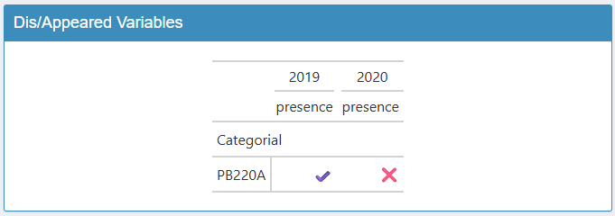

The table on the left lists the variables that showed a notable variation. Each row is a variable that changed between two values of the wave. By default, the reference wave is the last value of the variable (here 2020 for the year), and the comparison is made with the second-to-last value (here 2019). You can change the reference value, or add comparison values. Note that the table becomes hard to read beyond two comparison values. Cells are coloured when the gap is large enough.

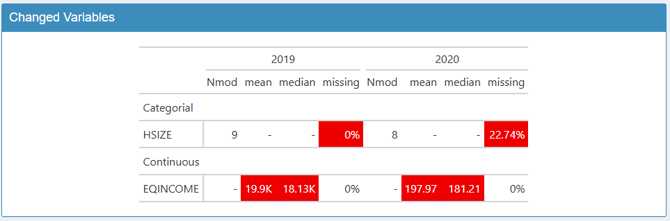

For categorical variables, this may be too large a gap in the share of missing values or in the number of categories. Here we find the variable `HSIZE`, which shows an increase in missing values. For continuous variables, it may be too large a gap in the share of missing values, the mean or the median. Here we find the variable `EQINCOME`, with the thousands-scale error.

This sensitivity threshold can be adjusted, displaying more or fewer variables. You can also vary the number of non-missing values required to include a variable in the analysis.

## Graphical analysis

For each variable detected in this tab, charts are available in the *Graphics* tab to better understand the gaps between waves. The chart on the left illustrates the distribution of the variable for the reference wave. The chart on the right illustrates the comparison between the selected waves.

Here is the example for the categorical variable `HSIZE`. The large share of missing values in 2020 is detected automatically.

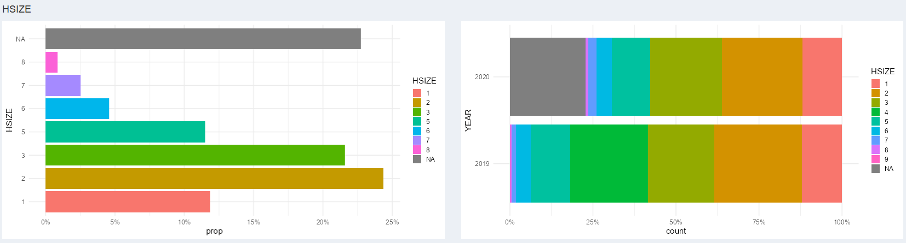

Here is the example for the continuous variable `EQINCOME`. The difference in scale between the two distributions is detected automatically.

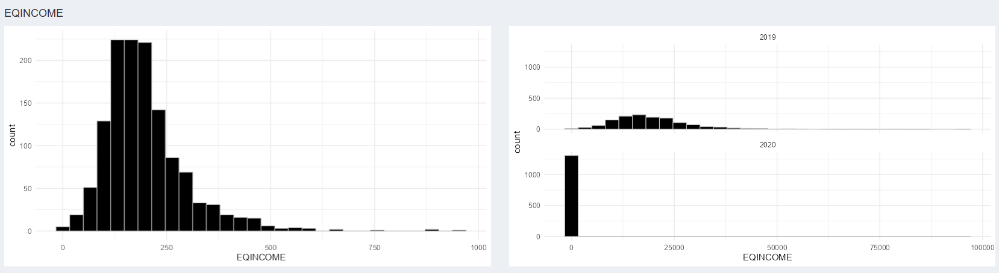

## Summary: step-by-step analysis

1.  **Select** the survey and the period.
2.  **Choose** the *Wave* tab.
3.  **Filter** the database on a particular filter value, and adjust the display settings.
4.  **List** the variables that appeared and disappeared, and check whether this is justifiable.
5.  **Scan** the variables that changed, to check each gap shown in red.
6.  **Analyse** these variables using the charts.
7.  **Record** the problematic cases (new category, very different distribution, etc.).

# Conclusion

The interviewer or wave consistency analysis is an essential step in the quality control of a survey, but it is not meant to produce automatic judgements. {vizsurvey} infers nothing: it organises the exploration and highlights the regularities, gaps or inconsistencies likely to draw the attention of the field coordination team. The interpretation of the results must always rely on the operational context: the instructions given to interviewers, the collection conditions, and so on. These elements alone make it possible to distinguish a genuine anomaly from a mere structural effect.

Moreover, the information used sometimes concerns sensitive data, about interviewers as well as about the households surveyed; it must therefore be handled in strict compliance with the applicable rules on confidentiality and personal data protection. In our view, anyone using {vizsurvey} must be subject to the same confidentiality rules as those applying to the source data files. Indeed, anonymisation is in no way guaranteed in the interface: the crossings, filters or visualisations offered may indirectly reveal individual information or interviewer identifiers. Access to {vizsurvey} must therefore be restricted to people authorised to consult the detailed data, in a secure setting compliant with internal data-management policies.

In short, {vizsurvey} is an analysis-support tool that complements those currently used by survey teams, not an automatic diagnostic tool. It makes collection behaviour visible and equips survey teams, but the final conclusions always rest on the informed judgement of those teams.